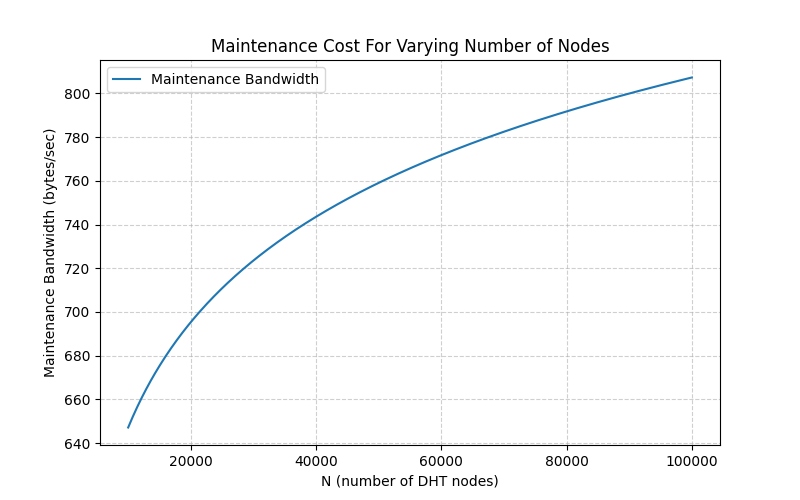
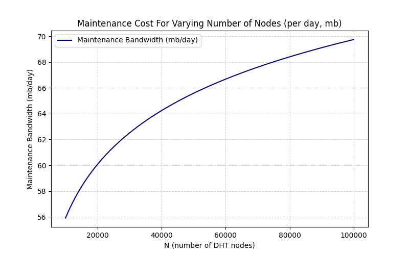
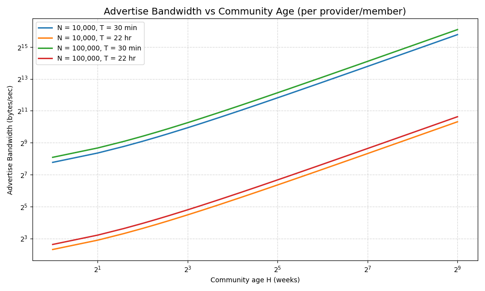
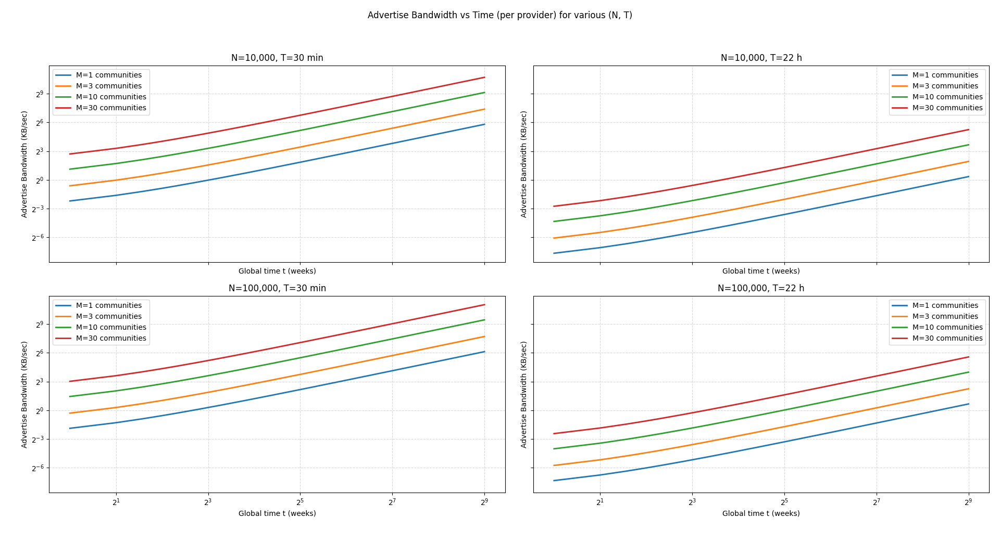
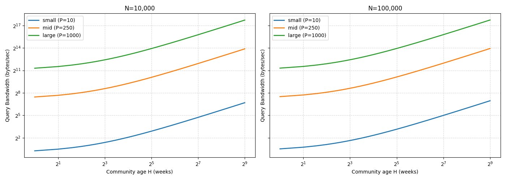
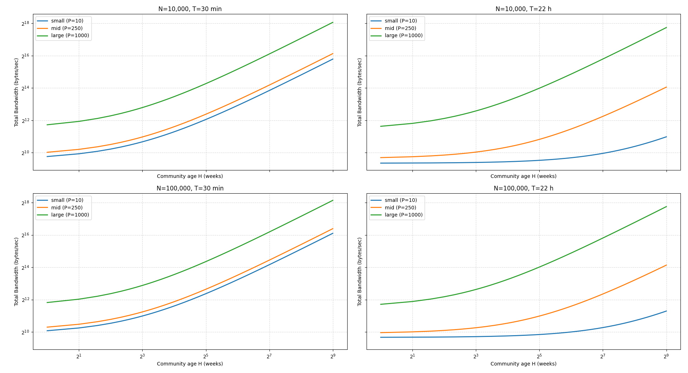

# Swarm Participant Upper Bounds of DHT

Description:
> We need to have a clear understanding of what the upper bounds of our proposed solution to replace bittorrent in status-go will be. In particular, replacing a single message archive torrent (index + ever-growing data) with an index CID and a CID for each message archive dataset will cause DHT strain. Every 7 days, a new archive and updated index will be uploaded, and replicated to all members of the swarm. What is the upper bound of community members and average number of communities per node that can be supported by the DHT for such a system?

Some more Context: [Guiliano's write-up](https://hackmd.io/tw3oYZ10S8Kg1EoFJdRLpw) 

This boils down to answering/measuring two things:
- **What is the upper bound of community members?** meaning, how many members can a community contain without straining the DHT.
- **What is the average number of communities per-node?** meaning, given that we expect each community to contain x number of members, how many communities can a node be part of?

So how to go about analyzing this? We can follow these steps:
- Start with understanding the DHT traffic first, [Chrys's write-up](https://hackmd.io/tzafQHRgRfKcKAfQ-xBm3Q) categorizes these so we can start there.
- The parameters or variables involved in each of these traffic categories, and the formulas to estimate traffic (for each category) based on these params/variables.
- Based on our use-case (the status community archive) we can select which traffic is mostly expected and what ranges the variables in + measurements of msg sizes (to estimate bandwidth).
- Run some calculations (on expected variable ranges) to estimate the expected bandwidth per-provider (community member), and create figures/plots to show how it scales with increasing number of contents (archive CIDs). 
- Based on these numbers, we can then estimate the lower/upper bounds of the number of communities and number of members in each of these communities. This ofcourse would depend what is an acceptable bandwidth that a node can handle. 

## DHT Traffic
Let's look at the source of traffic in DHTs. I will use some of the terms and symbols from [Chrys's write-up](https://hackmd.io/tzafQHRgRfKcKAfQ-xBm3Q) for consistency. I'm restating it here with more elaboration mainly for (me) understanding. 

**Maintenance Traffic**
The traffic overhead to keep the overlay network healthy.
- Generated by: All DHT participants regardless of whether they store or query content.
- Purpose: DHT network topology - each node periodically:
    - Pings its neighbors (keep-alives).
    - Refreshes its routing table.
    - Handles churn (detecting failed peers & replacing them).
- Scaling: depends on the number of nodes `N` and i think it should be proportional to $log_2(N)$ (because routing tables are organized in k-buckets). Doesn't depend on content pieces `C`. 

Normally maintainance traffic is a small fraction of the overall traffic as also pointed out by Chrys's calculation. We should still include this in our analysis, but it wouldn't play a major role or so i assume.

**Content Traffic**
The traffic generated when nodes publish “I can provide content X”. This is in Codex `addProvider(nodeId/CID, SPR)`
- Generated by: nodes storing content pieces that must be discoverable (provider nodes only).
- Purpose: "I have CID_X"
- Scaling: Proportional to: 
    - Number of providers `P` 
    - Content pieces `C`
    - TTL/Refresh frequency `T`
    - churn rate of providers `λ`.

This is the major cause of traffic in our use-case and is proportional to the number of members in the community and grows endlessly with time as more archive files are created. 

**Query Traffic**
The traffic from nodes asking “Who has content X?”, in Codex this is `getProviders(nodeId/CID)`
- Generated by: Any node needing content, in our case, members needing the archive e.g. new members.
- Purpose: "Who has CID_X"
- Scaling: Proportional to average query rate per content piece `Q`

In a stable state there are no queries, aside from the weekly distribution from the control node since every member has the archive. However, there are two additional cases in which nodes/community members would query the archive data (or parts of it): (1) When joining the community you request the whole archive. (2) When a node goes offline for a while and then comes back then the request would be only for parts of the archive, how many parts (CIDs) depend on how long it has been offline. The first situation is probably easier to estimate than the second.

**What is main source of traffic in our case?**
Since the majority of nodes in the status archive use-case are seeders, the main cost is around refreshing the DHT tracker (Content Traffic) + some maintenance cost (Maintenance Traffic) + Query traffic (depending on the factors described above). 

## Variables
Let's look at the variables involved in our use-case. Recall that the archive is generated by the control node which initially the only one publishing the content, then everyone in the community replicate and becomes a provider as well. I'm ignoring the initial distribution part here, and will assume all members of a community will store the archive. Note, I'm not saying here all **nodes**, I'm saying all **members**.

- `C` = number of content pieces to index (number of archive files per member/provider)
- `P` = average providers per content (number of community members)
- `Q` = average queries per content piece per second
- `N` = number of DHT nodes
- `K` = DHT replication factor (typically 3-20)
- `T` = TTL/update interval (provider refresh period, seconds)
- `λ` = provider churn rate (providers joining/leaving per unit time)

If we want to measure the DHT strain/traffic per-community we can split `C` to:
$C_{com} = H + 1$: number of archive files per-community, where `H` is community age in weeks.
$C_{all} = \sum_0^k (H + 1)$: number of archive files for all `k` communities a node is part of, where `H` is community age in weeks.

Note: we add 1 above for the index file. 

## Some Calculations/Analysis
### Formulas
For each of the traffic categories, we can try to come up with formulas to measure it. We need to measure traffic per-node, but we can measure the RPC or bandwidth (bytes). Let's go with bandwidth for now, knowing that: 
$$
\text{RPC/s } \times \text{ msg size} = \text{bandwidth (bytes/s)}
$$

We can get some estimate on the sizes of these rpc messages from the Codex implementation.

For **maintainance traffic**:
Based on the [Codex DHT](https://github.com/codex-storage/nim-codex-dht) we can observe that for DHT maintainance we have:
(1) Keep-alive / ReValidation:
- We have two parameters: `RevalidateMin = 5s` and `RevalidateMax=10s` 
- Ping & Pong: Every $\tau_{keepalive} = 7.5s$  on average (`(RevalidateMin+RevalidateMax)/2`), ping 1 peer. 
- $S_{ping}$: ping msg size, measured value is 15 bytes
- $S_{pong}$: pong msg size, measured value is 35 bytes

(2) Refresh:
FindNodeMessage & NodesMessage: 
- Every $\tau_{refresh} = 5 min$ perform one random lookup to find `k` closest nodes. 
- Cost per-lookup: $C_{lookup} = \alpha \log_2(N)$
- i.e. send $C_{lookup}$ requests (FindNodeMessage) and receive $C_{lookup}$ responses (NodesMessage). 
- $\alpha = 3$
- K = 16 neighbours 
- FindNodeMessage ($S_{find}$): measured msg size is 20 bytes
- NodesMessage ($S_{nodes}$) = 5 + N × (record size + 1). Record size is 300 bytes avg. $S_{nodes}$ depends on the number of SPRs in the response (MAX is 16 split into multiple responses each with MAX 3 SPRs), we can expect the MAX 16 meaning size is around 4800 bytes

As I see it we need to calculate two things: Keep-alives and refresh/lookups:

(1) Keep-alives (per-node)
$$
\text{Bandwidth}_{keepalive} =
\frac{S_{ping} + S_{pong}}{\tau_{keepalive}} (bytes/sec)
$$
Based on the measured values:
- Bandwidth per sec = 6.67 bytes/sec - **constant**
- Per-day: 11520 Ping&Pong msgs per-node
- Bandwidth per day: 576,200 bytes/day

(2) Bucket refreshes (per-node)
$$
\text{Bandwidth}_{refresh} =
\frac{C_{lookup} \cdot (S_{find} + S_{nodes})}{\tau_{refresh}} (bytes/sec)
$$

Thus the maintanance bandwidth is:
$$
Bandwidth_{maintenance} \text{ (per-node)} =
\text{Bandwidth}_{keepalive} + \text{Bandwidth}_{refresh}
$$

For **Content/advertize traffic**:
Every provider node that stores a content key (CID) must (re-)advertize it every time-interval `T`. Each advertize has a cost, let's use the term $C_{adv}$ for cost-per-advertize (in RPC). The cost to advertise a single content is two parts: (1) find the `K` closest nodes to the CID in the DHT keyspace, (2) send `addProvider` msgs to these `K` nodes. This is summarized in the following formula:

$$
RPC_{adv} \text{ (per-content, per-provider)} = C_{lookup} + K
$$

To measure the bandwidth, we need the msg sizes. We already defined the msg sizes for lookup as $S_{find}, S_{nodes}$ , now we need to introduce the following symbol:
- $S_{AP}$ : AddProviderMsg, a request msg from the advertiser to the `K` nodes. Based on our measurement this is 234 bytes.

I'm assuming here there is no "ack" response to `AddProvider`. Now the formula for bandwidth per-content per-provider is the following:
$$
Bandwidth_{adv}^{\text{ (content,provider)}} = \frac{C_{lookup} \times (S_{find} + S_{nodes}) + K \times S_{AP}}{T} \text{ (bytes/sec)}
$$

Then the per-provider bandwidth:
$$
Bandwidth_{adv}^{\text{ (provider)}} = C \times Bandwidth_{adv}^{\text{ (content,provider)}} \text{ (bytes/sec)}
$$

Again in the above formulas I'm ignoring churn rate and assuming a constant number of providers `P`

For **query traffic**:
The query traffic is highly dependent on the query rate `Q` which is somewhat difficult to estimate, but fortunately the formulas are quite simple as we will see next.

The number of RPCs required to query is the same as the advertisement one, i.e. to find the providers of a specific content key, you first have to find the `K` closest nodes through lookup, then send `getProviders` to these `K` nodes. Therefore:

$$
RPC_{query} \text{ (per-content)} = C_{lookup} + K
$$

To measure bandwidth we need msg sizes again so let's introduce new symbols:
- $S_{GP}$ : GetProvider, a request to get the providers for a content key, measured = 33 bytes. 
- $S_{PM}$ : ProvidersMessage, reponse containing a list of `P` providers - approx equals to `5 + P*300` bytes. Note here that `P` is 5 max but if more than 5 then multiple msgs are sent, for simplicity we can just assume `P*305`. 

The per-content bandwidth (bytes/sec) formula is
$$
Bandwidth_{query}^{\text{content}} = Q \times C_{lookup} \times (S_{find} + S_{nodes}) + K \times (S_{GP} + S_{PM}) \text{ (bytes/sec)}
$$

Then we can estimate the per-node bandwidth using:
$$
\text{Bandwidth}_{query} =
C \times Bandwidth_{query}^{\text{content}}
$$

Note that the above formula calculates the bandwidth per-node/provider given the query rate `Q`, but this rate is expected to be equal for all providers. There is no "symmetry" here, i.e. if you are a part of certain communities, this rate might be high/low. This depends on few things:
- The content in the status community archive use-case is the archive files which I would assume isn't affected by "popularity" meaning that we don't have popular content that can skew the query rate toward some files over the others (e.g. popular videos/imgs). Instead, what would be factors in this setting are the following:
    - The members' churn rate (members going offline then online)
    - The number/rate of new members joining the community.
    - The size of the community -> bigger community, more churn + more joiners.
- Although the content (archive files) are replicated to all members (per-community), this doesn't change the fact that `getProviders` will have to be sent to `k` nodes in the DHT space (those closest to the archive CID) and these nodes will be hot-spots when you have communities affected by the factors above.

**Total Bandwidth**
Given the formulas above, we would like to calculate the expected bandwidth for a node/provider. This comes to summing up the three main bandwidth formulas above:

$$
\begin{aligned}
\text{Bandwidth}_{\text{total}}
&=Bandwidth_{maintenance} + Bandwidth_{adv} + Bandwidth_{query} \\
\text{Bandwidth}_{\text{total}}
&= \frac{S_{\text{ping}} + S_{\text{pong}}}{\tau_{\text{keepalive}}} + \frac{C_{\text{lookup}}\,(S_{\text{find}}+S_{\text{nodes}})}{\tau_{\text{refresh}}}
\\ &\quad + \frac{C}{T}\Big(C_{\text{lookup}}\,(S_{\text{find}}+S_{\text{nodes}}) + K\,S_{\text{AP}}\Big)
\\ &\quad + C\,Q \Big(C_{\text{lookup}}\,(S_{\text{find}}+S_{\text{nodes}}) + K\,(S_{\text{GP}}+S_{\text{PM}})\Big)
\end{aligned}
$$

expanded to:

$$
\begin{aligned}
\text{Bandwidth}_{\text{total}}
&= \frac{S_{\text{ping}} + S_{\text{pong}}}{\tau_{\text{keepalive}}} \\
&\quad + \frac{\alpha \log_{2}(N)\,(S_{\text{find}} + S_{\text{nodes}})}{\tau_{\text{refresh}}} \\
&\quad + \frac{C}{T}\Big(\alpha \log_{2}(N)\,(S_{\text{find}} + S_{\text{nodes}}) + K\,S_{\text{AP}}\Big) \\
&\quad + C\,Q \Big(\alpha \log_{2}(N)\,(S_{\text{find}} + S_{\text{nodes}}) + K\,(S_{\text{GP}} + S_{\text{PM}})\Big)
\end{aligned}
$$

### Expected range for variables
In the formula for total bandwidth, we can plug-in our measured values for msg sizes and constants, these are stated again in the following:

| Symbol            | Meaning                                    | Value                          |
|-------------------|--------------------------------------------|--------------------------------|
| $S_{ping}$          | Ping message size                          | 15 bytes                           |
| $S_{pong}$          | Pong message size                          | 35 bytes                           |
| $\tau_{keepalive}$     | Keepalive period                           | 7.5 s                          |
| $\tau_{refresh}$       | Bucket refresh period                      | 300 s (5 min)                  |
| $\alpha$               | Lookup factor                              | 3                              |
| $K$               | DHT replication factor (k-closest)         | 16                             |
| $S_{find}$          | FIND_NODE request size                     | 20 bytes                           |
| $S_{nodes}$         | NODES response (max)                       | ≈ 4800 bytes                       |
| $S_{AP}$            | AddProvider request size                   | 234 bytes                          |
| $S_{GP}$            | GetProviders request size                  | 33 bytes                           |
| $S_{PM}$            | ProvidersMessage response size             | 305*P bytes (P = providers)|

Plugging-in these numbers in the formula would give us:

$$
\begin{aligned}
\text{Bandwidth}_{\text{total}}
&= \frac{15 + 35}{7.5} \\
&\quad + \frac{3 \log_{2}(N)\,(20 + 4800)}{300} \\
&\quad + \frac{C}{T}\Big(3 \log_{2}(N)\,(20 + 4800) + 16 \cdot 234\Big) \\
&\quad + C\,Q \Big(3 \log_{2}(N)\,(20 + 4800) + 16\,(33 + 305P)\Big)
\end{aligned}
$$

Simplified:
$$
\begin{aligned}
\text{Bandwidth}_{\text{total}}
&= 6.67 \\
&\quad + 48.2 \,\log_{2}(N) \\
&\quad + \frac{C}{T}\,\big(14460 \,\log_{2}(N) + 3744\big) \\
&\quad + C\,Q\,\big(14460 \,\log_{2}(N) + 528 + 4880P\big)
\end{aligned}
$$

Now let's talk about expected ranges for each of the variables above ($N,P,C,T,Q$). 

`N` the number of nodes in the DHT, in our use-case this would be all status (desktop?) nodes, i.e. all members of all communities. 
This could range from 10K - 100K nodes depending on how popular status is, we can maybe get some numbers?

`P` the number of providers per-content. This depends on the size of the community, i.e. the larger the community, the mode providers would be because we assume all community members replicate the data. We can estimate this to be in the range 10-1000 members, but we can also assume that about %50-%70 of them are online at any one time, so `P` would be about half of the expected number of members and then we can also ignore churn rate, and expect constant number of providers. Note here that since all members are providers, it means for large communities, the list providers for content key (CID) is long, so the response to `getProviders` would be a big list. Although if there is a limit to how many providers is in the response then this won't be a bandwidth issue, maybe a storage issue (for storing that long list)!?

`C` the number of content pieces/keys. This variable in our setting increases with time (in weeks) and so we should model this as function of time since the begining of each community. Each community would have about 52 archive files/CIDs a year then multiply this by the number of communities to get `C`. See $C_{com}$ and $C_{all}$ described previously.

`T` provider refresh time interval. Looking at the bittorrent docs, this value is about 15-30min with TTL of about 2hr, but in libp2p this values much higher, around 22h with TTL of 48hr. In Codex, the blockExchange protocol advertizes every 30min with TTL of 24hr. The range is then 30min-24h for `T`

`Q` the query rate per-content. This I would expect to be small in our setting but depends on how often nodes/community members go offline. In a stable state, every member has the archive and there are no queries. However, as stated earlier there are two cases in which nodes/community members would query the archive data (or parts of it): (1) When joining the community you request the whole archive. (2) When a node go offline for a while and then comes back then the request would be only for part of the archive and how many parts (CIDs) depend on how long it has been offline. The first situation is easier to estimate than the second. We can try to experess this as a function of size of the community `P`, Let's give it a try here:
We can consider these factors:
- $\lambda_{\text{join}}$ : community-wide new join rate (joins per second) 
- $\lambda_{\text{churn}}$ : per-provider churn rate (avg rejoins per second) 
- $\theta_{\text{re}}$ : fraction of content keys a re-joining node must query.

We can use the above to calculate `Q` which sums up to part:
(1) new joins: each new node that joins needs to fetch all content keys `C`, so the rate per-content is just $\lambda_{\text{join}}$

(2) re-joins: each online provider has a probability of going offline and then re-joining, which we describe with $\lambda_{\text{churn}}$, if there are `P` providers (members) then the expected number of rejoins is $P \cdot \lambda_{\text{churn}}$, but the rejoiners will only request a fraction of the content (archive) `C` , meaning they will only request $C \cdot \theta_{\text{re}}$. 
So given that we expect $P \cdot \lambda_{\text{churn}}$ providers to rejoin per-sec and they will do $C \cdot \theta_{\text{re}}$ queries, then we expect the number of queries for all contents to be: $P \cdot \lambda_{\text{churn}} \cdot C \cdot \theta_{\text{re}}$

Now with `Q` we want the query rate **per-content** so we divide by `C` to get: $P \cdot \lambda_{\text{churn}} \cdot \theta_{\text{re}}$

Therefore, the query rate can be expressed as:
$$
Q \;=\; Q_{\text{join}} + Q_{\text{churn}}
\;=\; \lambda_{\text{join}} \;+\; P\,\lambda_{\text{churn}}\,\theta_{\text{re}}.
$$

Here is a table to summarize the variables:

| Variable                      | Expected Range                                             | Notes                                                                                                                                         |
| ----------------------------- | ---------------------------------------------------------- | --------------------------------------------------------------------------------------------------------------------------------------------- |
| $N$: DHT nodes               | $10^4 - 10^5$                                              | All Status desktop/mobile nodes.                                                                                               |
| $P$: providers per content   | \~5 - 500                                                  | 10–1000 members per community × 50–70% online.                                                                                                |
| $C$: content keys            | \~50–100 per community per year, global = sum across comms | 52 weekly archives + 1 index each year. Grows linearly with age.                                                                              |
| $T$: refresh interval        | 30min – 22 h                                                  | BitTorrent = 15–30 min, libp2p reprovides every \~22 h.                                                                          |
| $Q$: query rate per content  | $Q =\; \lambda_{\text{join}} \;+\; P\,\lambda_{\text{churn}}\,\theta_{\text{re}}$                |   Depends on the size of the community, larger communities would expect more members to join over time and more members to log-off/log-on |

### Results: Calculations and Figures
In here we should our results for calculating the expected bandwidth per-provider (community member) for each DHT traffic category, and then for the total. Measuring the expected bandwidth tells us how much each member should expect to spend (in bandwidth) on the archive by participating in a community or multiple communities. 

#### Maint Bandwidth
Recall the simplified maintainance traffic formula is the following:

$$
\text{Bandwidth}_{\text{maint}} = 6.67 + 48.2 \log_{2}(N)
$$

In the formula we have one variable which is `N` number of nodes. We can vary `N` from $2^4 - 2^5$ and see the expected traffic in the following figures (one per-sec and one per-day).

#### Advertise Bandwidth
The simplified formula for traffic is:
$$
\text{Bandwidth}_{\text{adv}} =  \frac{C}{T}\Big(3 \log_{2}(N)\,(20 + 4800) + 16 \cdot 234\Big)
$$

We have three variables here ($C, T, N$), but ideally we would like the x-axis to represent the number of contents (archive files) $C$ so that we see how increasing the number of archive CID affects the DHT. So, we can fix the other variables to known used values. We can consider:
- $N$ to be either $2^4$ or $2^5$
- $T$ to be either 30min or 22hr

In addition to the previous, we can represent x-axis as age of the community in weeks (`H`) and see how the traffic grows with the age of the community. See the following figure:

We can clearly see the affect of the short re-advertise rate (30min) in the figure above!

The previous figure considers a single community, let's now look at the bandwidth expected when a provider (member) is a part of multiple communities, see next figures:

#### Query Bandwidth
The last category of traffic is the query traffic with the formula:
$$
\text{Bandwidth}_{\text{query}} = C\,Q\,\big(14460 \,\log_{2}(N) + 528 + 4880P\big)
$$
where $Q$ is:
$$
Q \;=\; \lambda_{\text{join}} \;+\; P\,\lambda_{\text{churn}}\,\theta_{\text{re}}.
$$

This formula contains more variables than previous ones, and plotting for all would not be useful, so we can try to turn some of them into constants:
- We can consider 3 community sizes: small (10 members), mid (250 members), and large (1000 members). So $P = \{10,250,1000\}$ 
- We can use $N =\{2^4,2^5\}$ , as we did before.
- We can calculate $Q$ based on these assumptions:
    - The join rate ($\lambda_{\text{join}}$) can be expressed as $\frac{0.05P}{7}$ meaning 5% of $P$ will join a week. This is just an assumption but it takes into account the size of the community so the larger the community (more popular), the more new joiners we can expect. We then divide that by $86400$ to get per-sec rate.
    - Churn rate ($\lambda_{\text{churn}}$) only makes sense in this setting if the provider (community member) is offline for more than a week since the archive is updated on a weekly basis. Let's assume 10% of $P$ will request one archive file a week (+index) which gives us $(\frac{0.1}{7}*P*\frac{2}{C})$
    - Based on the previous assumptions, we can then calculate $Q$ per-sec as:
    $Q = \frac{0.05P}{7*86400} + \frac{0.1}{7*86400}*P*\frac{2}{C}$

With these assumptions, the expected bandwidth can be seen in the following figure:

#### Total Bandwidth
Using the same assumptions on the variable ranges, we can see the total expected bandwidth in the following:

The above figure combines all expected bandwidth and in general it shows:
- Bandwidth is not much affected by the number of nodes $N$
- The re-advertize time interval plays a significant role in increasing the bandwidth.
- The number of members and age of community affects the bandwidth as expected. 

To understand which traffic category plays a major role here, let's try to measure the percentage of each, see next tables (the number of weeks is chosen at random):

---
### N = 10,000, T = 30 min

**small (P=10)**
| H (weeks) | C (=H+1) | Total (B/s) | Maint % | Adv % | Query % |
|---:|---:|---:|---:|---:|---:|
|  26 |  27 | 3.592e3 |  18.02% |  81.81% |   0.17% |
|  52 |  53 | 6.426e3 |  10.07% |  89.75% |   0.18% |
| 104 | 105 | 12.095e3 |   5.35% |  94.47% |   0.18% |
| 208 | 209 | 23.434e3 |   2.76% |  97.06% |   0.18% |
| 416 | 417 | 46.111e3 |   1.40% |  98.41% |   0.18% |

**mid (P=250)**
| H (weeks) | C (=H+1) | Total (B/s) | Maint % | Adv % | Query % |
|---:|---:|---:|---:|---:|---:|
|  26 |  27 | 4.491e3 |  14.41% |  65.43% |  20.16% |
|  52 |  53 | 8.079e3 |   8.01% |  71.39% |  20.60% |
| 104 | 105 | 15.256e3 |   4.24% |  74.90% |  20.86% |
| 208 | 209 | 29.610e3 |   2.19% |  76.81% |  21.00% |
| 416 | 417 | 58.319e3 |   1.11% |  77.81% |  21.08% |

**large (P=1000)**
| H (weeks) | C (=H+1) | Total (B/s) | Maint % | Adv % | Query % |
|---:|---:|---:|---:|---:|---:|
|  26 |  27 | 16.586e3 |   3.90% |  17.72% |  78.38% |
|  52 |  53 | 30.319e3 |   2.13% |  19.02% |  78.84% |
| 104 | 105 | 57.785e3 |   1.12% |  19.77% |  79.11% |
| 208 | 209 | 112.717e3 |   0.57% |  20.18% |  79.25% |
| 416 | 417 | 222.581e3 |   0.29% |  20.39% |  79.32% |

---
### N = 10,000, T = 22 h

**small (P=10)**
| H (weeks) | C (=H+1) | Total (B/s) | Maint % | Adv % | Query % |
|---:|---:|---:|---:|---:|---:|
|  26 |  27 | 720.105 |  89.87% |   9.27% |   0.86% |
|  52 |  53 | 789.601 |  81.96% |  16.60% |   1.44% |
| 104 | 105 | 928.592 |  69.69% |  27.97% |   2.34% |
| 208 | 209 | 1.207e3 |  53.63% |  42.84% |   3.52% |
| 416 | 417 | 1.763e3 |  36.72% |  58.52% |   4.77% |

**mid (P=250)**
| H (weeks) | C (=H+1) | Total (B/s) | Maint % | Adv % | Query % |
|---:|---:|---:|---:|---:|---:|
|  26 |  27 | 1.619e3 |  39.97% |   4.12% |  55.90% |
|  52 |  53 | 2.442e3 |  26.50% |   5.37% |  68.14% |
| 104 | 105 | 4.089e3 |  15.83% |   6.35% |  77.82% |
| 208 | 209 | 7.383e3 |   8.77% |   7.00% |  84.23% |
| 416 | 417 | 13.970e3 |   4.63% |   7.38% |  87.99% |

**large (P=1000)**
| H (weeks) | C (=H+1) | Total (B/s) | Maint % | Adv % | Query % |
|---:|---:|---:|---:|---:|---:|
|  26 |  27 | 13.714e3 |   4.72% |   0.49% |  94.79% |
|  52 |  53 | 24.682e3 |   2.62% |   0.53% |  96.85% |
| 104 | 105 | 46.618e3 |   1.39% |   0.56% |  98.05% |
| 208 | 209 | 90.489e3 |   0.72% |   0.57% |  98.71% |
| 416 | 417 | 178.232e3 |   0.36% |   0.58% |  99.06% |

---
### N = 100,000, T = 30 min

**small (P=10)**
| H (weeks) | C (=H+1) | Total (B/s) | Maint % | Adv % | Query % |
|---:|---:|---:|---:|---:|---:|
|  26 |  27 | 4.473e3 |  18.05% |  81.79% |   0.17% |
|  52 |  53 | 8.003e3 |  10.09% |  89.74% |   0.17% |
| 104 | 105 | 15.062e3 |   5.36% |  94.47% |   0.17% |
| 208 | 209 | 29.180e3 |   2.77% |  97.06% |   0.17% |
| 416 | 417 | 57.416e3 |   1.41% |  98.42% |   0.18% |

**mid (P=250)**
| H (weeks) | C (=H+1) | Total (B/s) | Maint % | Adv % | Query % |
|---:|---:|---:|---:|---:|---:|
|  26 |  27 | 5.402e3 |  14.94% |  67.73% |  17.32% |
|  52 |  53 | 9.710e3 |   8.31% |  73.96% |  17.72% |
| 104 | 105 | 18.327e3 |   4.40% |  77.64% |  17.96% |
| 208 | 209 | 35.559e3 |   2.27% |  79.65% |  18.08% |
| 416 | 417 | 70.025e3 |   1.15% |  80.70% |  18.15% |

**large (P=1000)**
| H (weeks) | C (=H+1) | Total (B/s) | Maint % | Adv % | Query % |
|---:|---:|---:|---:|---:|---:|
|  26 |  27 | 17.590e3 |   4.59% |  20.80% |  74.61% |
|  52 |  53 | 32.120e3 |   2.51% |  22.36% |  75.13% |
| 104 | 105 | 61.180e3 |   1.32% |  23.26% |  75.42% |
| 208 | 209 | 119.300e3 |   0.68% |  23.74% |  75.58% |
| 416 | 417 | 235.541e3 |   0.34% |  23.99% |  75.67% |

---
### N = 100,000, T = 22 h

**small (P=10)**
| H (weeks) | C (=H+1) | Total (B/s) | Maint % | Adv % | Query % |
|---:|---:|---:|---:|---:|---:|
|  26 |  27 | 897.828 |  89.91% |   9.26% |   0.83% |
|  52 |  53 | 984.126 |  82.03% |  16.59% |   1.39% |
| 104 | 105 | 1.157e3 |  69.79% |  27.96% |   2.26% |
| 208 | 209 | 1.502e3 |  53.75% |  42.86% |   3.39% |
| 416 | 417 | 2.192e3 |  36.82% |  58.58% |   4.60% |

**mid (P=250)**
| H (weeks) | C (=H+1) | Total (B/s) | Maint % | Adv % | Query % |
|---:|---:|---:|---:|---:|---:|
|  26 |  27 | 1.826e3 |  44.20% |   4.55% |  51.25% |
|  52 |  53 | 2.691e3 |  29.99% |   6.07% |  63.94% |
| 104 | 105 | 4.421e3 |  18.26% |   7.31% |  74.43% |
| 208 | 209 | 7.881e3 |  10.24% |   8.17% |  81.59% |
| 416 | 417 | 14.801e3 |   5.45% |   8.68% |  85.87% |

**large (P=1000)**
| H (weeks) | C (=H+1) | Total (B/s) | Maint % | Adv % | Query % |
|---:|---:|---:|---:|---:|---:|
|  26 |  27 | 14.014e3 |   5.76% |   0.59% |  93.65% |
|  52 |  53 | 25.101e3 |   3.22% |   0.65% |  96.13% |
| 104 | 105 | 47.275e3 |   1.71% |   0.68% |  97.61% |
| 208 | 209 | 91.622e3 |   0.88% |   0.70% |  98.42% |
| 416 | 417 | 180.317e3 |   0.45% |   0.71% |  98.84% |

## Conclusion & Future Work
From the results, we can observe a few things:
- For small/mid size communities, the readvertise is the main factor so increasing the time interval $T$ to readvertise would save a lot of bandwidth. 
- For large size communities, the query rate actually dominates so increasing $T$ alone won't save you there, so in this setting it might make more sense to reduce the number of providers, i.e. not all community members must store the whole archive, a subset would do the job given the large size of the community, 25-50% of the community would be suffcient although one must be careful with the churn rate in large communities. 
- For large communities with large number of providers, we assume the response to `getProviders` would a long list of providers, but it would save a lot of bandwidth to simply cap the response to say $15$ providers.

It is difficult to conclude with a concrete number for the lower/upper bound of the size of the communities and number of communities simply because there are multiple variable that need to be taken into account. However, our results gives an estimate of the expected bandwidth a provider/member would have to handle in different settings: community size (small/mid/large), readvertise time interval ($T$). 

For future work we can look into:
- Consider churn-rate and provide better estimate for the join rate based on real measured data, e.g. based on status communities or other similar apps.
- Analysis on the provider record liveliness in our setting/use-case since that plays a factor on the re-advertise time interval (also related to churn rate). Possibly follow up on the previous research on this: [RFM 17: Provider Record Liveness](https://github.com/probe-lab/network-measurements/blob/master/results/rfm17-provider-record-liveness.md)
- Research alternative options that scales better with the community size and number of communities. Options include:
    - Move to one append-only archive file
    - Merging & bundling at a longer time interval
    - Consider mutable data CIDs
