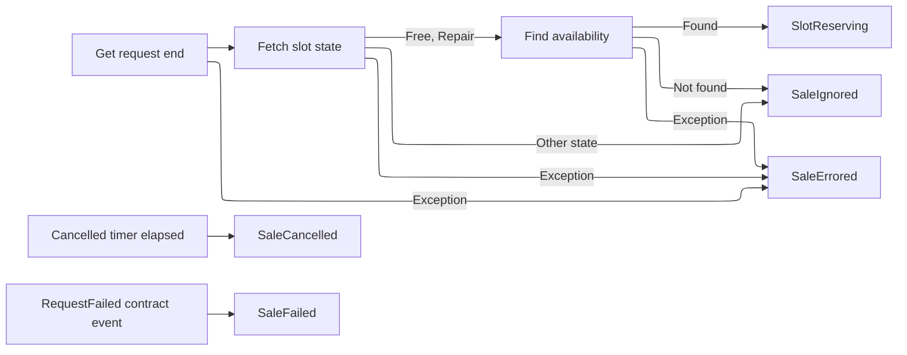
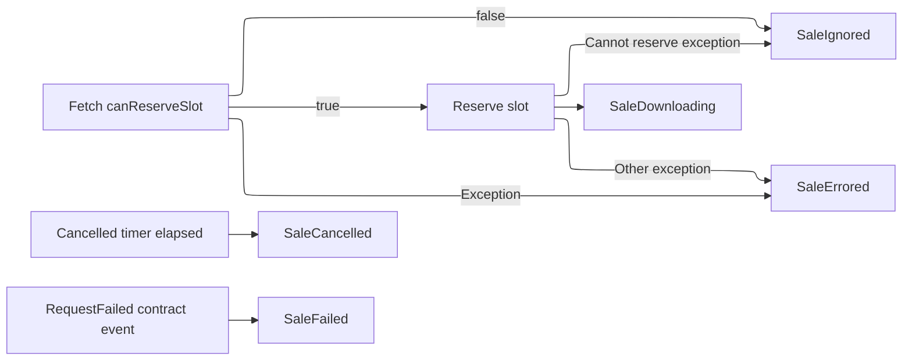
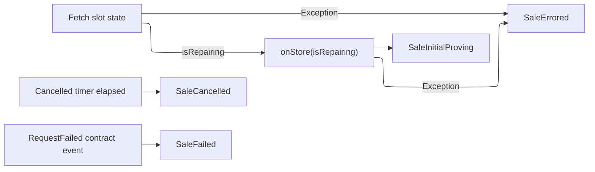
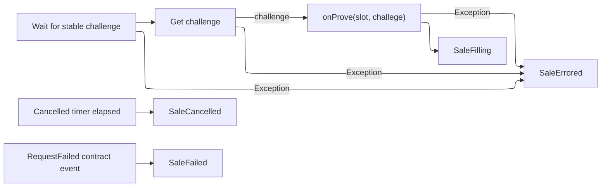
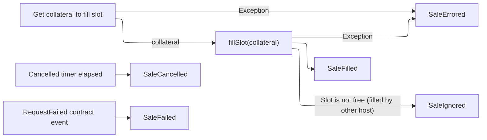
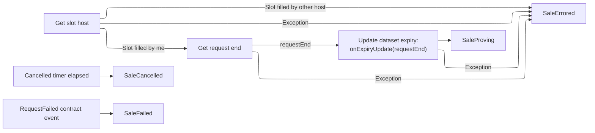
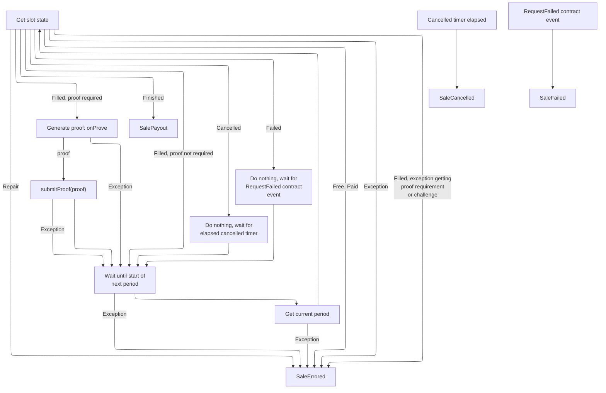
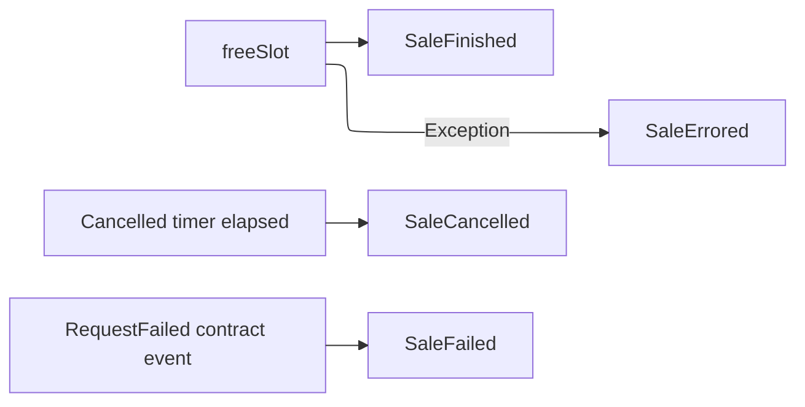
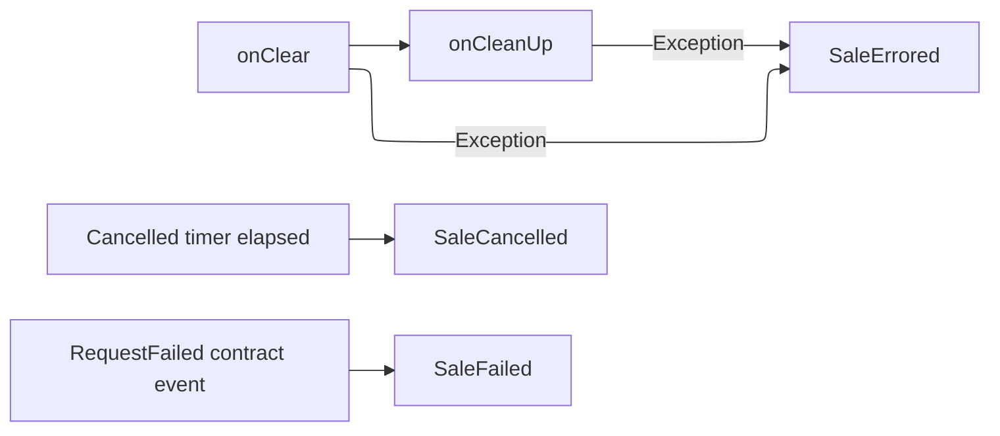

# Recoverability analysis

The analysis captures the ability of the sales process to recover in cases of
crashes, exceptions, or cancellations. The document outlines two phases, both of
which are to be implemented after `RepoStore` reservations have been
removed.

TODO: describe Phase I vs Phase II changes

## Phased changes

### Phase I

Phase I will include changes to the [simplification of the Marketplace sales
design](https://github.com/codex-storage/codex-research/blob/refactor/simplified-sales-and-purchasing/design/sales2.md)
that do not include `SalesOrders` or any additional features. In addition, the
Marketplace will use expiries and no explicit deletes.

#### `RepoStore` changes

- move expiries from block-level to dataset-level
- add dataset-level locks (operations are serially processed)
- possibly add dataset-level ref counts?

#### Marketplace callback API changes

- Marketplace calls `onStore` with a `requestId, slotIdx, expiry = request.expiry` (and a manifest cid if needed)
- Marketplace calls `updateExpiry` with ` requestId, slotIdx` (and a manifest cid if needed)

### Phase II

Marketplace does not use expiries, but uses an explicit delete (locked). Phase
II will include the [simplification of the Marketplace sales
design](https://github.com/codex-storage/codex-research/blob/refactor/simplified-sales-and-purchasing/design/sales2.md)
but no additional features.

#### `RepoStore` changes

RepoStore will add support for explicit deletes.

#### Marketplace callback API changes

- Marketplace will no longer call `updateExpiry`
- Marketplace calls `onStore` with a `requestId, slotIdx` (and a manifest cid if needed)
- Marketplace calls `delete` with a `requestId, slotIdx` (and a manifest cid if needed)

### Phase III

Phase III will include additional Marketplace features that go beyond the
"baseline" [simplification of the Marketplace sales
design](https://github.com/codex-storage/codex-research/blob/refactor/simplified-sales-and-purchasing/design/sales2.md).

#### Marketplace concurrency support

Depends on: [Marketplace support for concurrent workers](https://github.com/codex-storage/codex-research/blob/refactor/simplified-sales-and-purchasing/design/sales2.md#concurrent-workers-prevent-unnecessary-resource-consumption)

- Avoid waiting for serial operations to finish when there are concurrent
  stores/deletes (due to locking) by implementing a Marketplace-level dataset
  ref count.

#### Resumable downloads support

Depends on: [Marketplace resumption of local state](https://github.com/codex-storage/codex-research/blob/refactor/simplified-sales-and-purchasing/design/sales2.md#resuming-local-state-eg-downloading)

- `onStore` will need to internally track the state of building a slot, to allow
  for recovery (Download Manager)
- When the Marketplace restores a local sale to the downloading state, `onStore`
  will be called and it will resume its operation based on the state.

#### `onStore` considerations

`onStore` is a long-running operation that may not finish before a request
cancellation. If this happens, `SaleDownloading.run` will be cancelled, which
will cancel the `onStore` call, so `onStore` will need to handle this exception
appropriately.

## Phase I: Expiries but no delete

Identify points in the sales state machine with crashes, exceptions, or
cancellations in between, especially with `RepoStore` writes and expiry updates.

### Preparing

| Situation                                                                         | Outcome                                                                           |
|-----------------------------------------------------------------------------------|-----------------------------------------------------------------------------------|
| CRASH at any point                                                                | The slot is forfeited, with no recovery on startup since the slot was not filled. |
| EXCEPTION at any point                                                            | The slot is forfeited.                                                            |
| CANCELLATION during "get request end", "fetch slot state", or "find availability" | The slot is forfeited.                                                            |

### Slot Reserving

| Situation                                             | Outcome                                                                          |
|-------------------------------------------------------|----------------------------------------------------------------------------------|
| CRASH at any point                                    | The slot is forfeited, with no recovery on startup since the slot was not filled |
| EXCEPTION at any point                                | The slot is forfeited.                                                           |
| CANCELLATION during `canReserveSlot` or `reserveSlot` | The slot is forfeited.                                                           |

### Downloading

| Situation                                                                           | Outcome                                                                                                                                           |
|-------------------------------------------------------------------------------------|---------------------------------------------------------------------------------------------------------------------------------------------------|
| No crash/exception in `onStore(expiry)`                                             | Success                                                                                                                                           |
| CRASH before `onStore(expiry)`                                                      | The slot is forfeited, with no recovery on startup since the slot was not filled.                                                                 |
| CRASH in `onStore(expiry)`                                                          | The slot is forfeited, with no recovery on startup since the slot was not filled. The dataset will be eligible for cleanup at the request expiry. |
| CRASH after `onStore(expiry)` but before the transition to `SaleInitialProving`     | The slot is forfeited, with no recovery on startup since the slot was not filled. The dataset will be eligible for cleanup at the request expiry. |
| EXCEPTION before `onStore(expiry)`                                                  | Goes to `SaleErrored`. The slot is forfeited.                                                                                                     |
| EXCEPTION in `onStore(expiry)`                                                      | Goes to `SaleErrored`. The slot is forfeited. The dataset will be eligible for cleanup at the request expiry.                                     |
| EXCEPTION after `onStore(expiry)` but before the transition to `SaleInitialProving` | The slot is forfeited. The dataset will be eligible for cleanup at the request expiry.                                                            |
| CANCELLATION while fetching slot state                                              | The slot is forfeited.                                                                                                                            |
| CANCELLATION during `onStore`                                                       | The slot is forfeited. The dataset will be eligible for cleanup at the request expiry.                                                            |

### Initial proving

| Situation                                                                      | Outcome                                     |
|--------------------------------------------------------------------------------|---------------------------------------------|
| CRASH at any point                                                             | The slot is forfeited.                      |
| EXCEPTION at any point                                                         | Goes to SaleErrored. The slot is forfeited. |
| CANCELLATION during "wait for stable challenge", "get challenge", or `onProve` | The slot is forfeited.                      |

### Filling

| Situation                                          | Outcome                                                                                                                                                                                                                                                                                                     | Solution                                                                                                                                                                                                                                                                                                                                                                                            |
|----------------------------------------------------|-------------------------------------------------------------------------------------------------------------------------------------------------------------------------------------------------------------------------------------------------------------------------------------------------------------|-----------------------------------------------------------------------------------------------------------------------------------------------------------------------------------------------------------------------------------------------------------------------------------------------------------------------------------------------------------------------------------------------------|
| `fillSlot(collateral)` successful                  | SUCCESS                                                                                                                                                                                                                                                                                                     |                                                                                                                                                                                                                                                                                                                                                                                                     |
| CRASH before `fillSlot(collateral)` completes      | The slot is forfeited, with no recovery on startup since the slot was not filled. On restart, the dataset will be eligible for cleanup by the maintainer on request expiry.                                                                                                                                 |                                                                                                                                                                                                                                                                                                                                                                                                     |
| CRASH before state transitions to `SaleFilled`     | On chain state is restored at startup, starting in the `SaleFilled` state, which extends the expiry. Since the expiry wasn't extended before the crash, the dataset is at risk of being cleanup by the maintainer. This requires the maintenance module to wait for state restoration to complete.          |                                                                                                                                                                                                                                                                                                                                                                                                     |
| EXCEPTION during `fillSlot(collateral)`            | Goes to `SaleErrored`. The slot is forfeited. The dataset will be eligible for cleanup by the maintainer on request expiry.                                                                                                                                                                                 | For network errors, check the slot state as it may have been filled. Implement retry functionality, with exponential backoff.                                                                                                                                                                                                                                                                       |
| EXCEPTION before state transitions to `SaleFilled` | No recovery options here. Since the slot is already filled, the SP is required to provide proofs and will likely be slashed for missing proofs.                                                                                                                                                             | This would be an exception raised in the state machine, but not in the `SaleFilling` state. Because the state machine itself does not raise any exceptions, this is unlikely.                                                                                                                                                                                                                       |
| CANCELLATION during "get collateral to fill slot"  | The slot is forfeited. The dataset will be eligible for cleanup by the maintainer on request expiry.                                                                                                                                                                                                        |                                                                                                                                                                                                                                                                                                                                                                                                     |
| CANCELLATION during `fillSlot`                     | If the slot had not been filled on chain, the slot is forfeited and the dataset will be eligible for cleanup by the maintainer on request expiry. However, if the slot was filled on chain, then there are no recovery options and the SP will likely miss required storage proofs, leading to slashing(s). | Possible options include: 1. Catch cancellation, check slot state. If slot is filled, raise a Defect, crashing the node and forcing a restart. On startup, slot will enter the `SaleFilled` state. 2. Log an error and increment a metric counter. 3. Do not propagate the cancellation. The sale will move to the `SaleFilled` state. Waiters (eg `cancelAndWait` may wait indefinitely). |

### Filled

| Situation                                                                          | Outcome                                                                                                                                                                                                                       | Solution                                                                                                                                                                                                                                                                                                                                                                                                |
|------------------------------------------------------------------------------------|-------------------------------------------------------------------------------------------------------------------------------------------------------------------------------------------------------------------------------|---------------------------------------------------------------------------------------------------------------------------------------------------------------------------------------------------------------------------------------------------------------------------------------------------------------------------------------------------------------------------------------------------------|
| Dataset expiry updated to `requestEnd`                                             | SUCCESS                                                                                                                                                                                                                       |                                                                                                                                                                                                                                                                                                                                                                                                         |
| CRASH before `onExpiryUpdate(requestEnd)` completes                                | On chain state is restored at startup, starting in the `SaleFilled` state, which extends the expiry. Since the expiry wasn't completely extended before the crash, the dataset is at risk of being cleanup by the maintainer. | This requires the maintenance module to wait for state restoration to complete.                                                                                                                                                                                                                                                                                                                         |
| CRASH before transition to `SaleProving` state                                     | On chain state is restored at startup, starting in the `SaleFilled` state, which extends the expiry, then moves to `SaleProving`. Dataset is not a risk of getting cleaned up since its expiry was updated.                   |                                                                                                                                                                                                                                                                                                                                                                                                         |
| EXCEPTION during "get slot host" or "get request end" (ie a network-level failure) | Goes to `SaleErrored`. No recovery options. SP will not submit proofs when required and will eventually be slashed.                                                                                                           | For network exceptions, implement retry functionality, with exponential backoff. For other exceptions, go to `SaleErrored`. Exceptions may include any errors resulting from the JSON RPC call, or errors originating in ethers.                                                                                                                                                                        |
| EXCEPTION during `onExpiryUpdate`                                                  | Goes to `SaleErrored`. No recovery options. SP will not submit proofs when required and will eventually be slashed.                                                                                                           | Possible options include: 1. Raise a Defect, crashing the node and forcing a restart. On startup, slot will enter the `SaleFilled` state and will retry expiry update. May create an infinite crashing loop. 2. Log an error and increment a metric counter. 3. Continue to the `SaleProving` state. Dataset will be eligible for cleanup after request expiry, potentially causing slashings. |
| CANCELLATION during "get slot host", "get request end"                             | Goes to `SaleErrored`. No recovery options. SP will not submit proofs when required and will be at risk of being slashed.                                                                                                     | Possible options include: 1. Raise a Defect, crashing the node and forcing a restart. On startup, slot will enter the `SaleFilled` state. 2. Log an error and increment a metric counter. 2. Do not propagate the cancellation. The sale will move to the `SaleProving` state. Waiters (eg `cancelAndWait` may wait indefinitely).                                                             |

### Proving

| Situation                                                                                      | Outcome                                                                                                                                                  | Solution                                                                                                                                                                                                                                                                                                                                    |
|------------------------------------------------------------------------------------------------|----------------------------------------------------------------------------------------------------------------------------------------------------------|---------------------------------------------------------------------------------------------------------------------------------------------------------------------------------------------------------------------------------------------------------------------------------------------------------------------------------------------|
| CRASH at any point                                                                             | On chain state is restored at startup, starting in `SaleFilled` state which extends the expiry to request end (no op), then moves back to `SaleProving`. |                                                                                                                                                                                                                                                                                                                                             |
| EXCEPTION during `getSlotState`, `waitForNextPeriod`, `getCurrentPeriod`, or `getChallenge`    | Goes to `SaleErrored`, all proving is stopped and SP becomes at risk of being slashed.                                                                   | For network exceptions, implement retry functionality, with exponential backoff. For other exceptions, go to `SaleErrored`. Exceptions may include any errors resulting from the JSON RPC call, or errors originating in ethers.                                                                                                            |
| CANCELLATION during `getSlotState`, `waitForNextPeriod`, `getCurrentPeriod`, or `getChallenge` | Goes to `SaleErrored`, all proving is stopped and SP becomes at risk of being slashed.                                                                   | Possible options include: 1. Raise a Defect, crashing the node and forcing a restart. On startup, slot will enter the `SaleFilled` state, then move to `SaleProving`. 2. Log an error and increment a metric counter. 2. Do not propagate the cancellation. The sale will continue in the `SaleProving` state. Waiters (eg `cancelAndWait` may wait indefinitely). |

### Payout

| Situation                         | Outcome                                                                                                                                                                                                                                    | Solution |
|-----------------------------------|--------------------------------------------------------------------------------------------------------------------------------------------------------------------------------------------------------------------------------------------|--|
| `freeSlot` is successful          | SUCCESS                                                                                                                                                                                                                                    | |
| CRASH before `freeSlot` completes | On chain state is restored at startup, starting in `SalePayout`, where `freeSlot` will be tried again.                                                                                                                                     | |
| CRASH after `freeSlot` completes  | Slot is no longer part of `mySlots`, so on startup, slot state will not be restored.                                                                                                                                                       | |
| EXCEPTION during `freeSlot`       | Goes to `SaleErrored`. If `freeSlot` succeeded before the exception, no clean up routines will be performed. If `freeSlot` did not succeed before the exception, no funds will have been paid out and there are no recovery options.       | For network exceptions, implement retry functionality with exponential backoff. |
| CANCELLATION during `freeSlot`    | Goes to `SaleErrored`. If `freeSlot` succeeded before the cancellation, no clean up routines will be performed. If `freeSlot` did not succeed before the cancellation, no funds will have been paid out and there are no recovery options. |  |

### Finished

| Situation                               | Outcome                                                                                                                                  |
|-----------------------------------------|------------------------------------------------------------------------------------------------------------------------------------------|
| `onClear` and `onCleanUp` is successful | SUCCESS                                                                                                                                  |
| CRASH before `onCleanUp` completes      | On restart, slot will have been removed from `mySlot`, so nothing should happen. Anything missed in `onCleanUp` will not be recoverable. |
| EXCEPTION during `onCleanUp`            | Goes to `SaleErrored`. Since `onCleanUp` cleans up `SalesAgents`, there could be a memory leak.                                          |
| CANCELLATION during `onCleanUp`         | Since `onCleanUp` cleans up `SalesAgents`, there could be a memory leak.                                                                 |

## Phase II: No expiries but deletes

Depends on: `SalesOrder` implementation

Identify points of `SalesOrder` updates and `RepoStore` writes, with crashes,
exceptions, or cancellations in between.

### Downloading

`SalesOrders` are created in the downloading state before any data is written to
disk.

1. [DOWNLOADING] `SalesOrder` is created -> data downloaded in `onStore`: SUCCESS
2. [DOWNLOADING] CRASH -> `SalesOrder` is created -> data downloaded in `onStore`:
SUCCESS

- There are no asynchronicities here since there was no `SalesOrder` created
 and no blocks downloaded

1. [DOWNLOADING] `SalesOrder` is created -> CRASH -> data downloaded in `onStore`

- Without local state restoration:
  - On restart, corrective cleanup will delete the dataset (which doesn't
   exist) and the slot will be forfeited.
- With local state restoration:
  - On restart, the state will be restored before corrective cleanup deletes
   any datasets

1. [DOWNLOADING] `SalesOrder` is created -> CRASH while data downloading in
   `onStore`

### Deleting

Deletes can occur at any final state of the state machine: failed, finished,
errored, cancelled. `SalesOrders` are archived only after the dataset is deleted.
[FAILED] Dataset deleted -> `SalesOrder` archived: SUCCESS
[FAILED] Dataset deleted -> CRASH -> `SalesOrder` archived

- The `SalesOrder` remains in the "active" state and thus on restart, the
    corrective cleanup is run, deleting the dataset (which is already deleted)
    and finally archiving the `SalesOrder`.
[FAILED] Dataset deleted -> `SalesOrder` archived -> CRASH: SUCCESS

If the node goes down and corrupts the  (eg power failure) in mid-write of the RepoStore a