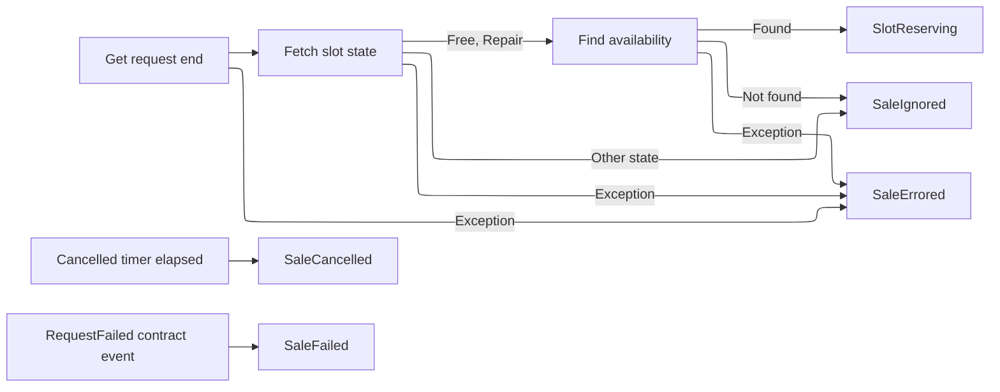
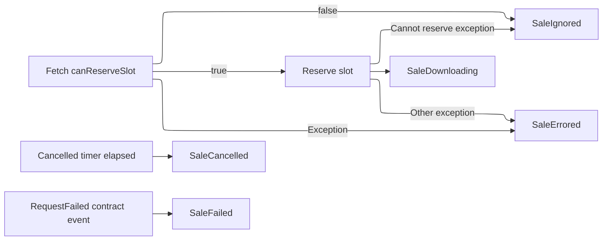
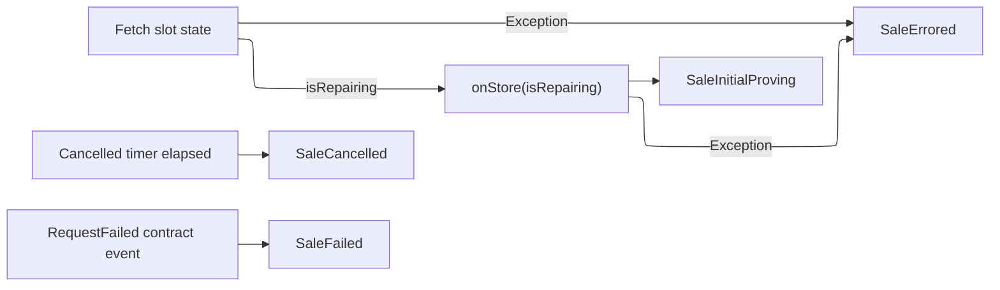
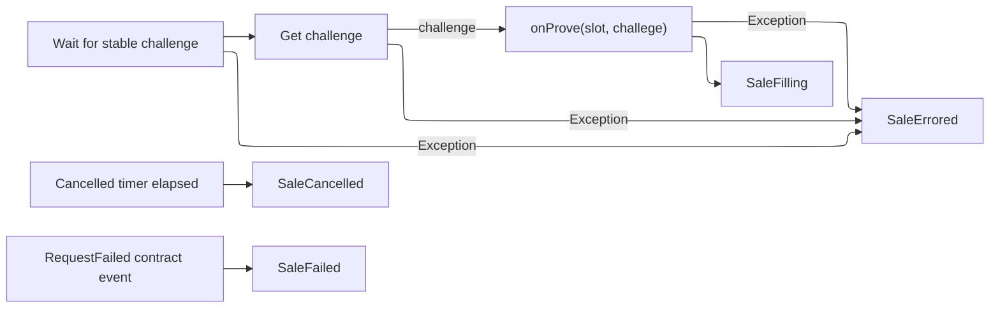
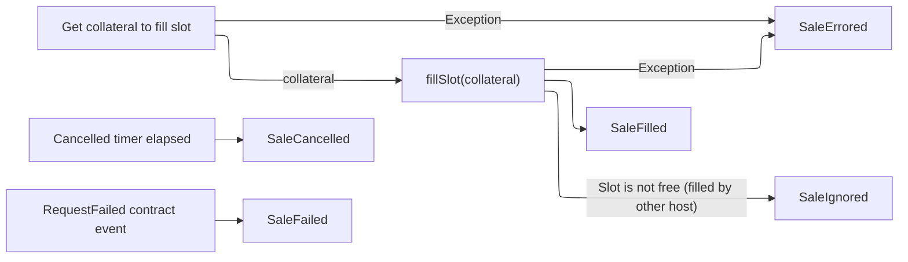
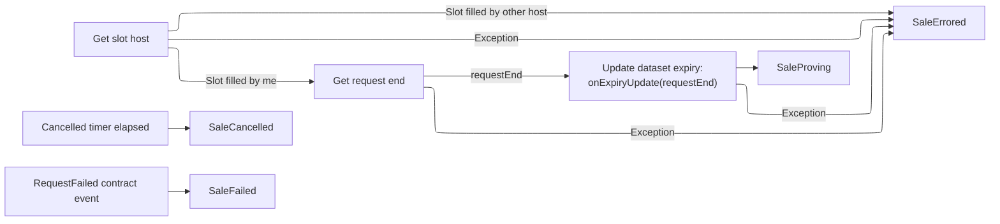
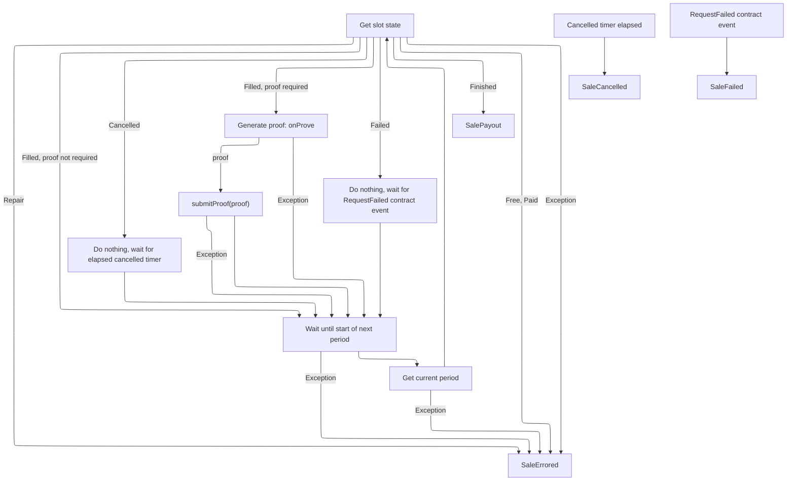
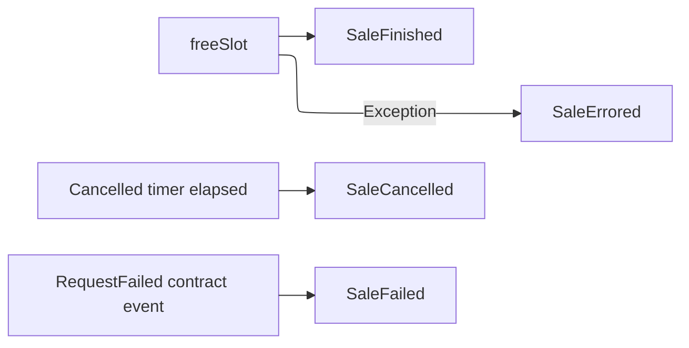
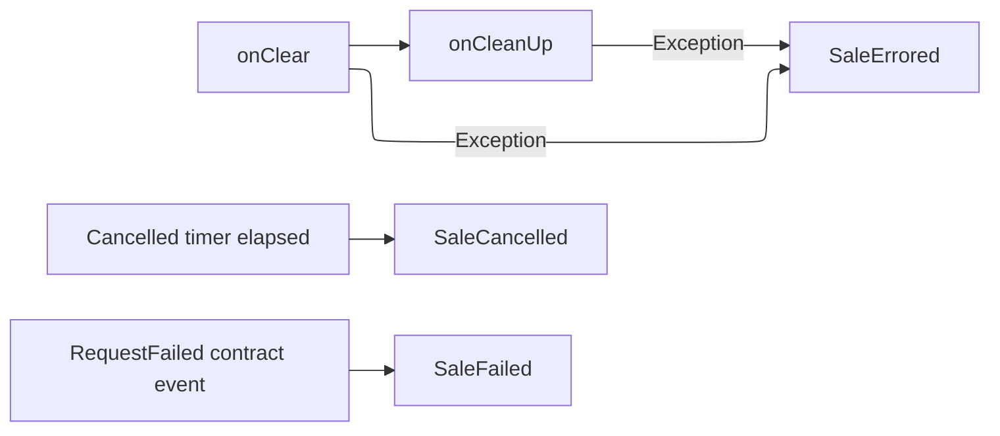

# Recoverabilty analysis

## Phase I: Expiries but no delete

Identify points of RepoStore writes and expiry updates with crashes, exceptions, or
cancellations in between.

### Preparing

| Situation                                                                         | Outcome                                                                           |
|-----------------------------------------------------------------------------------|-----------------------------------------------------------------------------------|
| CRASH at any point                                                                | The slot is forfeited, with no recovery on startup since the slot was not filled. |
| EXCEPTION at any point                                                            | The slot is forfeited.                                                            |
| CANCELLATION during "get request end", "fetch slot state", or "find availability" | The slot is forfeited.                                                            |

### Slot Reserving

| Situation                                             | Outcome                                                                          |
|-------------------------------------------------------|----------------------------------------------------------------------------------|
| CRASH at any point                                    | The slot is forfeited, with no recovery on startup since the slot was not filled |
| EXCEPTION at any point                                | The slot is forfeited.                                                           |
| CANCELLATION during `canReserveSlot` or `reserveSlot` | The slot is forfeited.                                                           |

### Downloading

| Situation                                                                           | Outcome                                                                                                                                           |
|-------------------------------------------------------------------------------------|---------------------------------------------------------------------------------------------------------------------------------------------------|
| No crash/exception in `onStore(expiry)`                                             | Success                                                                                                                                           |
| CRASH before `onStore(expiry)`                                                      | The slot is forfeited, with no recovery on startup since the slot was not filled.                                                                 |
| CRASH in `onStore(expiry)`                                                          | The slot is forfeited, with no recovery on startup since the slot was not filled. The dataset will be eligible for cleanup at the request expiry. |
| CRASH after `onStore(expiry)` but before the transition to `SaleInitialProving`     | The slot is forfeited, with no recovery on startup since the slot was not filled. The dataset will be eligible for cleanup at the request expiry. |
| EXCEPTION before `onStore(expiry)`                                                  | Goes to `SaleErrored`. The slot is forfeited.                                                                                                     |
| EXCEPTION in `onStore(expiry)`                                                      | Goes to `SaleErrored`. The slot is forfeited. The dataset will be eligible for cleanup at the request expiry.                                     |
| EXCEPTION after `onStore(expiry)` but before the transition to `SaleInitialProving` | The slot is forfeited. The dataset will be eligible for cleanup at the request expiry.                                                            |
| CANCELLATION while fetching slot state                                              | The slot is forfeited.                                                                                                                            |
| CANCELLATION during `onStore`                                                       | The slot is forfeited. The dataset will be eligible for cleanup at the request expiry.                                                            |

### Initial proving

| Situation                                                                      | Outcome                                     |
|--------------------------------------------------------------------------------|---------------------------------------------|
| CRASH at any point                                                             | The slot is forfeited.                      |
| EXCEPTION at any point                                                         | Goes to SaleErrored. The slot is forfeited. |
| CANCELLATION during "wait for stable challenge", "get challenge", or `onProve` | The slot is forfeited.                      |

### Filling

| Situation                                          | Outcome                                                                                                                                                                                                                                                                                                     |
|----------------------------------------------------|-------------------------------------------------------------------------------------------------------------------------------------------------------------------------------------------------------------------------------------------------------------------------------------------------------------|
| `fillSlot(collateral)` successful                  | SUCCESS                                                                                                                                                                                                                                                                                                     |
| CRASH before `fillSlot(collateral)` completes      | The slot is forfeited, with no recovery on startup since the slot was not filled. On restart, the dataset will be eligible for cleanup by the maintainer on request expiry.                                                                                                                                 |
| CRASH before state transitions to `SaleFilled`     | On chain state is restored at startup, starting in the `SaleFilled` state, which extends the expiry. Since the expiry wasn't extended before the crash, the dataset is at risk of being cleanup by the maintainer. This requires the maintenance module to wait for state restoration to complete.          |
| EXCEPTION before `fillSlot(collateral)` completes  | Goes to `SaleErrored`. The slot is forfeited. The dataset will be eligible for cleanup by the maintainer on request expiry.                                                                                                                                                                                 |
| EXCEPTION before state transitions to `SaleFilled` | No recovery options here. Since the slot is already filled, the SP is required to provide proofs and will likely be slashed for missing proofs.                                                                                                                                                             |
| CANCELLATION during "get collateral to fill slot"  | The slot is forfeited. The dataset will be eligible for cleanup by the maintainer on request expiry.                                                                                                                                                                                                        |
| CANCELLATION during `fillSlot`                     | If the slot had not been filled on chain, the slot is forfeited and the dataset will be eligible for cleanup by the maintainer on request expiry. However, if the slot was filled on chain, then there are no recovery options and the SP will likely miss required storage proofs, leading to slashing(s). |

### Filled

| Situation                                                                                                     | Outcome                                                                                                                                                                                                                                                                                                       |
|---------------------------------------------------------------------------------------------------------------|---------------------------------------------------------------------------------------------------------------------------------------------------------------------------------------------------------------------------------------------------------------------------------------------------------------|
| Dataset expiry updated to `requestEnd`                                                                        | SUCCESS                                                                                                                                                                                                                                                                                                       |
| CRASH before `onExpiryUpdate(requestEnd)` completes                                                           | On chain state is restored at startup, starting in the `SaleFilled` state, which extends the expiry. Since the expiry wasn't completely extended before the crash, the dataset is at risk of being cleanup by the maintainer. This requires the maintenance module to wait for state restoration to complete. |
| CRASH before transition to `SaleProving` state                                                                | On chain state is restored at startup, starting in the `SaleFilled` state, which extends the expiry, then moves to `SaleProving`. Dataset is not a risk of getting cleaned up since its expiry was updated.                                                                                                   |
| EXCEPTION during "get slot host" or "get request end" (ie a network-level failure) or during `onExpiryUpdate` | Goes to `SaleErrored`. No recovery options. SP will not submit proofs when required and will eventually be slashed.                                                                                                                                                                                           |
| CANCELLATION during "get slot host", "get request end" (ie a network-level failure)                           | Goes to `SaleErrored`. No recovery options. SP will not submit proofs when required and will be at risk of being slashed.                                                                                                                                                                                     |

### Proving

| Situation                                                                   | Outcome                                                                                                                                                  |
|-----------------------------------------------------------------------------|----------------------------------------------------------------------------------------------------------------------------------------------------------|
| CRASH at any point                                                          | On chain state is restored at startup, starting in `SaleFilled` state which extends the expiry to request end (no op), then moves back to `SaleProving`. |
| EXCEPTION during `getSlotState`, `waitForNextPeriod`, or `getCurrentPeriod` | Goes to `SaleErrored`, all proving is stopped and SP becomes at risk of being slashed.                                                                   |
| CANCELLATION during `getSlotState`, `waitForNextPeriod`, or `getCurrentPeriod` | Goes to `SaleErrored`, all proving is stopped and SP becomes at risk of being slashed.                                                                   |

### Payout

| Situation                         | Outcome                                                                                                |
|-----------------------------------|--------------------------------------------------------------------------------------------------------|
| `freeSlot` is successful          | SUCCESS                                                                                                |
| CRASH before `freeSlot` completes | On chain state is restored at startup, starting in `SalePayout`, where `freeSlot` will be tried again. |
| CRASH after `freeSlot` completes  | Slot is no longer part of `mySlots`, so on startup, slot state will not be restored.                   |
| EXCEPTION during `freeSlot`  | Goes to `SaleErrored`. If `freeSlot` succeeded before the exception, no clean up routines will be performed. If `freeSlot` did not succeed before the exception, no funds will have been paid out and there are no recovery options.                   |
| CANCELLATION during `freeSlot`  | Goes to `SaleErrored`. If `freeSlot` succeeded before the cancellation, no clean up routines will be performed. If `freeSlot` did not succeed before the cancellation, no funds will have been paid out and there are no recovery options.                   |

### Finished

| Situation                         | Outcome                                                                                                |
|-----------------------------------|--------------------------------------------------------------------------------------------------------|
| `onClear` and `onCleanUp` is successful          | SUCCESS                                                                                                |
| CRASH before `onCleanUp` completes | On restart, slot will have been removed from `mySlot`, so nothing should happen. Anything missed in `onCleanUp` will not be recoverable. |
| EXCEPTION during `onCleanUp`  | Goes to `SaleErrored`. Since `onCleanUp` cleans up `SalesAgents`, there could be a memory leak. |
| CANCELLATION during `onCleanUp`  | Since `onCleanUp` cleans up `SalesAgents`, there could be a memory leak. |

## Phase II: No expiries but deletes

Depends on: `SalesOrder` implementation

Identify points of `SalesOrder` updates and `RepoStore` writes, with crashes,
exceptions, or cancellations in between.

### Downloading

`SalesOrders` are created in the downloading state before any data is written to
disk.

1. [DOWNLOADING] `SalesOrder` is created -> data downloaded in `onStore`: SUCCESS
2. [DOWNLOADING] CRASH -> `SalesOrder` is created -> data downloaded in `onStore`:
SUCCESS

- There are no asynchronicities here since there was no `SalesOrder` created
 and no blocks downloaded

1. [DOWNLOADING] `SalesOrder` is created -> CRASH -> data downloaded in `onStore`

- Without local state restoration:
  - On restart, corrective cleanup will delete the dataset (which doesn't
   exist) and the slot will be forfeited.
- With local state restoration:
  - On restart, the state will be restored before corrective cleanup deletes
   any datasets

1. [DOWNLOADING] `SalesOrder` is created -> CRASH while data downloading in
   `onStore`

### Deleting

Deletes can occur at any final state of the state machine: failed, finished,
errored, cancelled. `SalesOrders` are archived only after the dataset is deleted.
[FAILED] Dataset deleted -> `SalesOrder` archived: SUCCESS
[FAILED] Dataset deleted -> CRASH -> `SalesOrder` archived

- The `SalesOrder` remains in the "active" state and thus on restart, the
    corrective cleanup is run, deleting the dataset (which is already deleted)
    and finally archiving the `SalesOrder`.
[FAILED] Dataset deleted -> `SalesOrder` archived -> CRASH: SUCCESS

If the node goes down and corrupts the  (eg power failure) in mid-write of the RepoStore a