# Sales module (add purchasing module)

The sales module is responsible for selling a node's available storage in the
[marketplace](./marketplace.md). In order to do so, it needs to create an
`Availability` for the storage provider (SP) to establish conditions under which
it is willing to enter into a sale. This is done in the `SalesStorage` module.

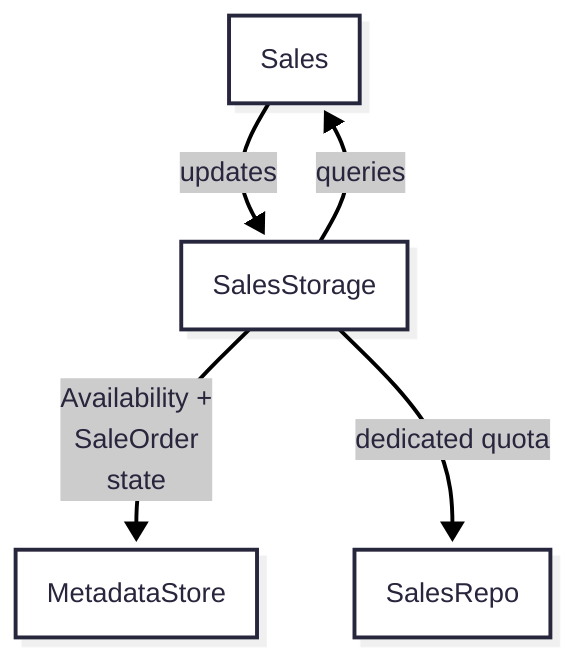

## Storage request lifecycle

### Selling storage

When a request for storage is submitted on chain, the sales module decides
whether or not it wants to act on it. First, it tries to match the incoming
request to the availability configured by the SP by comparing the storage
request's duration and price per byte per second to the values in the
availability. If there is a match, the SPs [funding
account](#funding-account-vs-profit-account) balance is checked to ensure there
is enough collateral that could be used for hosting the slot. If there is, the
SP moves on to reserving the slot, creating a `SalesOrder`, downloading the
content, generating a proof, and finally filling the slot by submitting the
proof and collateral to the contract.

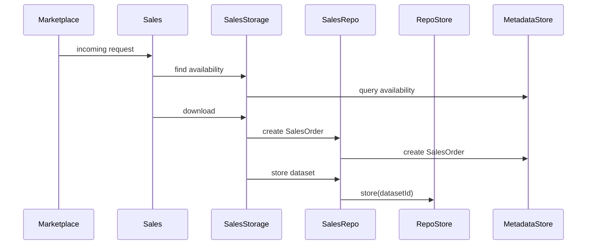

#### Sales state machine

Incoming storage requests are put into a slot queue and ordered by their
profiability. As slots are processed in the queue, an instance of a state
machine is created, called a `SalesAgent`. The `SalesAgent` is responsible for
moving the sales through each of the stages of its lifecycle.

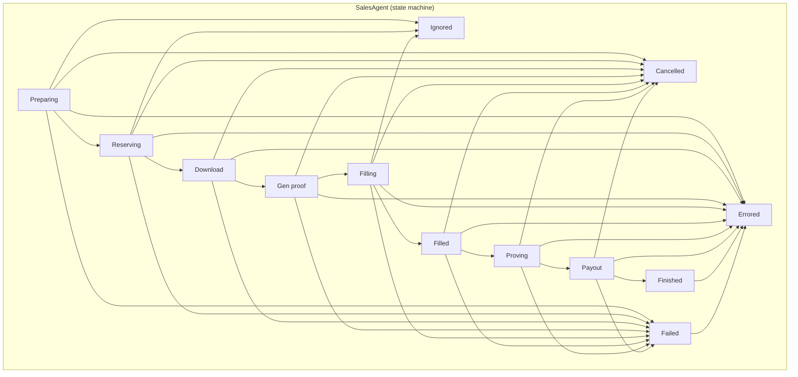

### Restoring on chain state

When a node is restarted, actively filled slots on chain are restored into their
last state in the state machine. This allows resumption of duties such as
providing regular proofs for storage requests, or freeing slots if the request
has ended.

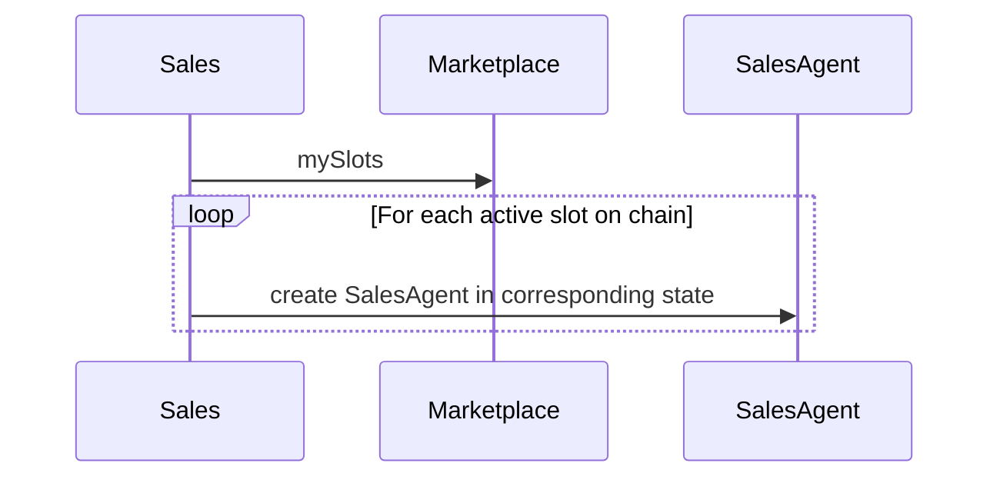

### Ending a request

When a storage request comes to an end, or if there was an error that occurred
along the way (such as a failed download), the content of the dataset will be
deleted and the `SalesOrder` will be archived. then the content can be removed from the
repo and the storage space can be made available for sale again. The same should
happen when something went wrong in the process of selling storage.

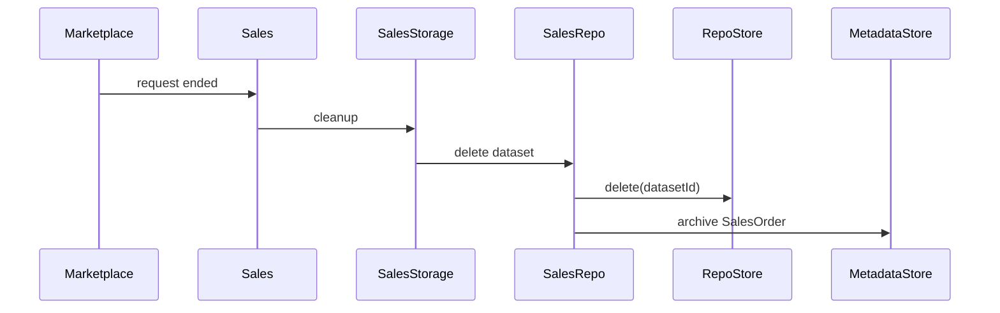

## `SalesStorage` module

The `SalesStorage` module manages the SP's availability and snapshots of past
and present sales or `SalesOrders`, both of which are persisted in the
`MetadataStore`. SPs can add and update their availability, which is managed
through the `SalesStorage` module. As a `SalesOrder` traverses the sales state
machine, it is created and updated[^updates_trackstate] through the
`SalesStorage` module. Queries for availability and `SalesOrders` will also
occur in the `SalesStorage` module. Datasets that are downloaded and deleted as
part of the sales process will be managed in the `SalesRepo` module.

[^updates_trackstate]: Updates are only needed to support [tracking the latest
             state in the `SalesOrder`](#tracking-latest-state-machine-state).

### Availability

The SP's availability determines which sales it is willing to attempt to enter
into. In other words, it represents *future sales* that an SP is willing to take
on[^designrules]. It consists of parameters that will be matched to incoming storage
requests via the slot queue.

[^designrules]: See [design rules](#design-rules) for a further explanation.

| Property                   | Description                                                                     |
|----------------------------|---------------------------------------------------------------------------------|
| `duration`                 | Maximum duration of a storage request the SP is willing to host new slots for.  |
| `minPricePerBytePerSecond` | Minimum price per byte per second that the SP is willing to host new slots for. |

The availability of a SP consists of the maximum duration and the minimum price
per byte per second to sell storage for.

#### `Availability` lifecycle

A user can add, update, or delete an `Availability` at any time. The
`Availability` will be stored in the MetadataStore. Only one `Availability` can
be created and once created, it will exist permanently in the MetadataStore
until it is deleted. The properties of a created `Availability` can be updated
at any time.

Because availability(ies) represents *future* sales (and not active sales), and
because fields of the matching `Availability` are persisted in a `SalesOrder`,
availabilities are not tied to active sales and can be manipulated at any time.

### `SalesOrder` object

The `SalesOrder` object represents a slot that a SP attempted to, or eventually
did host. `SalesOrders` are created only when there is an attempt to download
the slot data, meaning there was a successful availability match and a
successful slot reservation. The purpose of `SalesOrders` is to keep track of
sales for dataset cleanup operations, and to provide historical information for
the SP.

Cleanup routines will be able to query `SalesOrders` and compare them to those
that are filled on chain, to ensure that datasets that are no longer being
hosted do not remain on disk.

In addition, SPs will likely want to list slots that have been hosted in the
past. After a `StorageRequest` is completed, it is removed from the contract's
`mySlots` storage, with the `StorageRequest` information queryable only by
random access with the `RequestId`. Therefore, at a minimum, the `RequestId` and
slot index of the slot that was hosted would need to be persisted by the SP for
the SP to keep track of slots that were hosted.

| Property    | Description                                                                                                                                                   |
|-------------|---------------------------------------------------------------------------------------------------------------------------------------------------------------|
| `requestId` | `RequestId` of the `StorageRequest`. Can be used to retrieve storage request details.                                                                         |
| `slotIndex` | Slot index of the slot being hosted.                                                                                                                          |
| `treeCid`   | CID of the manifest dataset, used for `SalesRepo` interaction. TODO: `manifestCid` may not be sufficient. Final dataset identifier in the `RepoStore` is TBD. |
| `version`   | Object version used for migrations. |

#### `SalesOrder` lifecycle

At the point a SP reaches the `SaleDownload` state, a `SalesOrder` is created
and it will live permanently in the MetadataStore. `SalesOrder` objects cannot
be deleted as they represent historical sales of the SP.

When the `SalesOrder` object is first created, its key will be created in the
`/active` namespace. After data for the `SalesOrder` has been deleted (if there
is any) in a cleanup procedure, the key will be moved from the `/active`
namespace to the `/archive` namespace. These key namespace manipulations
facilitate future lookups in active/corrective cleanup operations.

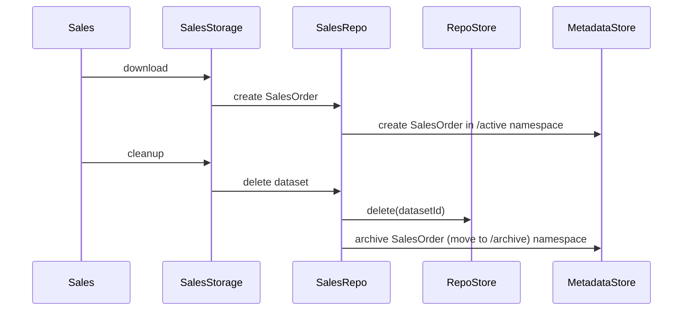

If there's support for [tracking the latest state in the
`SalesOrder`](#tracking-latest-state-machine-state), `SalesOrder.state`
will be modified as the sale progresses through each state of the Sales state
machine.

#### Migrations

Future updates to the `SalesOrder` object will require migration of existing
`SalesOrder` objects. In order for the node to understand which version of an
object is has at the time of migration, a `version` field is stored in the
`SalesOrder` object. After the migration has been performed, the version number
will be set to the version that has been migrated to.

### Query support

The `SalesStorage` module will need to support querying the availability and sales
data so the caller can understand if a sale can be serviced and to support clean
up routines. The following queries will need to be supported:

1. To know if there is enough space on disk for a new sale, the `SalesStorage`
   module can be queried for the remaining sales quota in its dedicated
   `SalesRepo` partition. In the future, this can be optimised to [prevent
   unnecessary resource
   consumption](#concurrent-workers-prevent-unnecessary-resource-consumption),
   by additionally querying the slot size of `SalesOrders` that are in or past
   the Downloading state (`/active` `SalesOrders`).
2. Cleanup routines will need to know the "active sales", or any `SalesOrders`
   in the `/active` key namespace (those that have not been archived) through
   the state machine or cleanup routines.
3. Servicing a new slot will require sufficient [total
   collateral](#total-collateral), which is the remaining balance in the funding
   account. In the future, this can be optimised to [prevent unnecessary
   resource
   consumption](#concurrent-workers-prevent-unnecessary-resource-consumption),
   by additionally querying the collateral of `/active` `SalesOrders`.

## `SalesRepo` module

The `SalesRepo` module is responsible for interacting with its underlying
`RepoStore`. This additional layer abstracts away some of the required
implementation routine needed for the `RepoStore`, while also allowing the
`RepoStore` to change independent of the sales module. It will expose functions
for storing and deleting datasets:

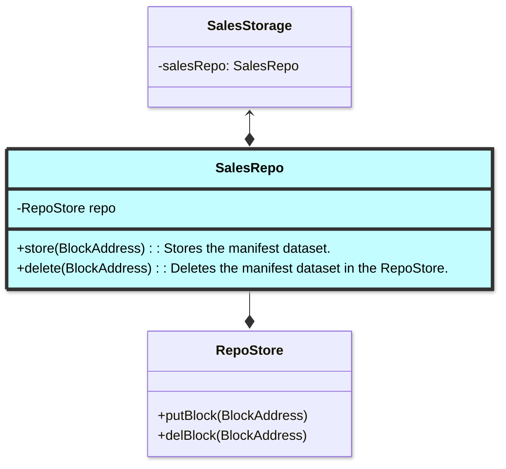

### RepoStore API

The underlying `RepoStore` of the `SalesRepo` is responsible to reading and
writing datasets to storage. Its API will include:

```nim
proc store(id: DatasetId)
 ## Stores blocks of the dataset, incrementing their ref count.
proc delete(id: DatasetId)
 ## Decreases the ref count of blocks of the dataset, deleting if the ref count is 0.
```

Datasets will be tracked by a particular id, but it is TBD as to what that ID
will be:

- Preferred option for MP is `manifestCID + slotIndex`.
- Alternative options discussed: `treeCid + slotIndex`, `slotRoot`.

## Total collateral

The concept of "total collateral" means the total collateral the SP is willing
to risk at any one point in time. In other words, it is willing to risk "total
collateral" tokens for all of its active sales combined. Total collateral is
determined by the balance of funds in the SP's funding account. So, any funds in
the funding account are considered available to use as collateral for filling
slots.

From the marketplace perspective, slots cannot be filled if there is an
insufficient balance in the funding account.

### Funding account vs profit account

SPs should control two accounts to safely host slots: a funding account, and a
profits account.

The funds in the funding account represent the total collateral
that a SP is willing to risk in all of its sales combined. This account will
need to have some funds in it before slots can be hosted, assuming the storage
request requires collateral. If a SP has been partially or wholly slashed in one
of their sales, they may wish to top up this account to ensure there is
sufficient collateral for future sales.

The profits account is the account for which proceeds from sales are paid into.
To minimise risk, this account should be stored in cold storage.

While a SP could technically specify the same address for both accounts, it is
recommended that the profit account is a separate account from the funding
account so that profits are not placed at risk by being used as collateral. If a
SP specifies the same account for funding and profits, and the SP is (partially
or wholly) slashed, future collateral deposits may use their profits from
previous sales.

Note: having a separate profit account relies on the ability of the Vault
contract to support multiple accounts.

## Cleanup routines

The responsibility of the cleanup routine is to ensure that any data that is no
longer part of an active sales is deleted from the `SalesRepo`. Once the data
has been deleted, the `SalesOrder` will reflect that it has been cleaned up by
being archived.

There are two types of cleanup routines that a SP node will take part in: active
and corrective. Active cleanup routines are run as part of a final state in the
Sales state machine. Corrective cleanup routines are continuously run at a
specified time interval with the goal of cleaning up any datasets that may not
have been cleaned up by active cleanup due to a node restart. Both perform a
similar task, however the active cleanups operate on a single `SalesOrder`,
while corrective cleanups operate over a set of `SalesOrders` and have additional
conditions for cleanup.

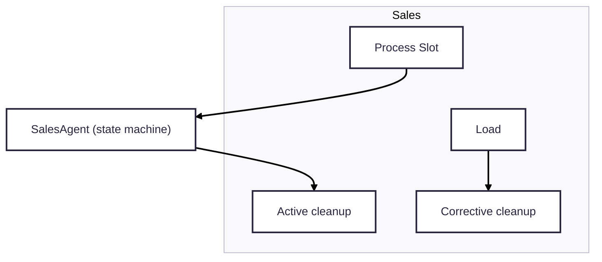

### Active cleanup

The active cleanup routine is typically run as part of the a final state in the
Sales state machine, eg `SaleFinished`. In this routine, active sales will be
retrieved from the Marketplace contract via `mySlots`. If the slot id associated
with the sale is not in the set of active sales, any data associated with the
slot will be deleted. Finally, the `SalesOrder` will be archived, by moving its
key to the `/archive` namespace.

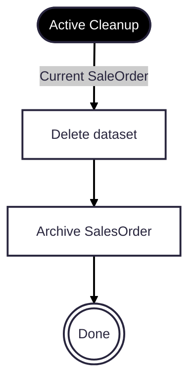

Note that in the case of [renewals](#renewals-prevent-dataset-deletion) or in
any case that the same dataset as the one being deleted is simultaneously being
downloaded or processed, the dataset ref count is enough to prevent deletion of
the dataset.

### Corrective cleanup

Node shutdowns can sometimes come in the middle of a non-atomic operation such
as persisting a `SalesOrder` and downloading a dataset. In this case, corrective
cleanup is needed to ensure that datasets that not being actively hosted are
removed from the node.

On node startup, active sales will be retrieved from the Marketplace contract
via `mySlots`. Then, all `SalesOrders` in the `/active` namespace will be
queried. Any `SalesOrders` with a slot id not in the set of active sales
(`mySlots`) will have the data associated with the slot deleted, if there is
any. Any `SalesOrders` associated with `StorageRequests` that are in the `New`
or `Fulfilled` state should be ignored in this process, otherwise datasets of
sales that are in the process of being processed may be impacted (particularly
important in the case of [resumable downloads](#resumable-downloads)). Finally,
the `SalesOrder` will be archived by moving its key to the `/archive` namespace.

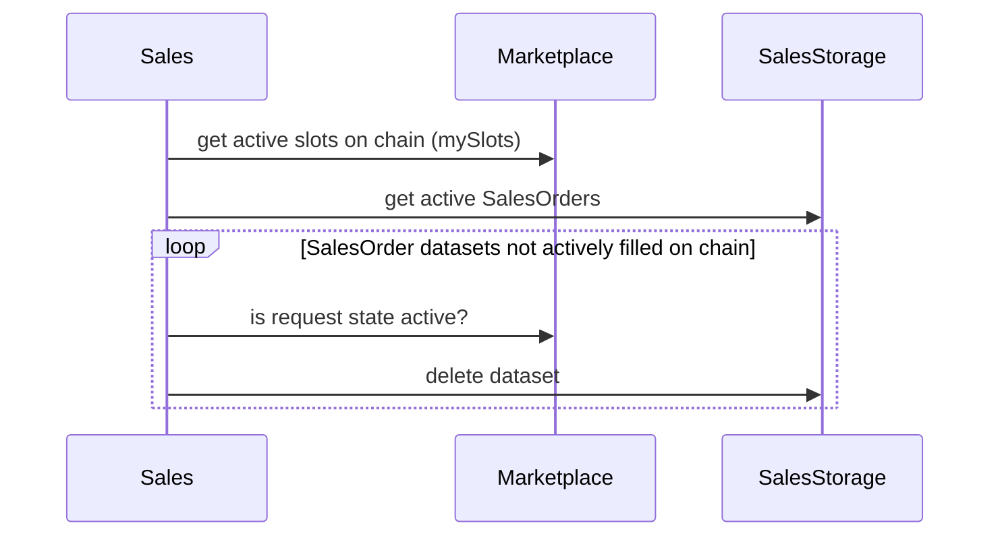

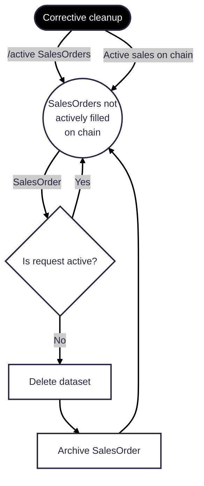

## Startup ordering

On startup, the Sales module should first restore the on chain state by loading
any filled slots into their respective state of the state machine. Performing
this step first prioritises filled slot duties of the SP, like provided storage
proofs.

Then, [corrective cleanup](#corrective-cleanup) and slot matching can start,
with corrective cleanup operating as a background task. It is important to note
that these two operations should not interfere with each other. Corrective
cleanup checks the `StorageRequest` state associated with the `SalesOrder` has
completed to ensure that it will not delete the datasets of sales that are being
processed by the SP (while slot matching).

Slot matching should wait for completion of restoration of on chain state to
prevent new hosting duties from consuming the thread and slowing down
already-committed hosting duties like submitting proofs.

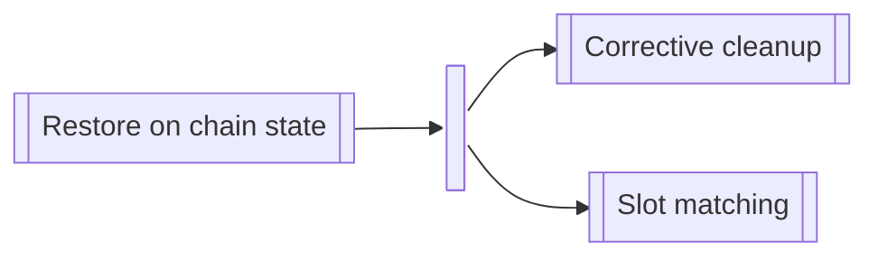

## Sale flow

[Insert flow charts]

## Optimisations and features

### Multiple availabilities

Multiple availabilities are useful to allow SPs to understand which Availability
parameters produce the most profit for them. Multiple availabilities can be
updated or deleted at any time. This is possible because there is no
availability ID stored in the `SalesOrder` object.

Note that the total collateral across all availabilities that a SP is
willing to risk remains as the balance of funds in the funding account.

Support for multiple availabilities will need to add new properties to the
`Availability` object:

| Property  | Description                                                                                                                      |
|-----------|----------------------------------------------------------------------------------------------------------------------------------|
| `id`      | ID of the Availability.                                                                                                          |
| `enabled` | If set to false, the SP will not use this Availability to host new slots.                                                        |
| `until`   | Only accept slots whose request ends before `until`. If set to 0, there will be no restrictions. Useful for planned maintenance. |

The `id` property will be used to form the key for storage in the
`MetadataStore`. This value will be used to uniquely identify the `Availability`
for CRUD and REST API operations.

The `enabled` property will allow an Availability to be disabled so that other,
enabled Availabilities can still be used to match new sales.

The `until` property matches Availabilities with requests that end before
`until`. This is useful if there is upcoming planning maintenance, such as a
disk swap.

### Concurrent workers support

Concurrent workers allow a SP to reserve, download, generate an initial proof
for, and fill multiple slots simultaneously. This could prevent SPs from missing
sale opportunities that arise while they are reserving, downloading, generating,
and generating an initial proof for another sale. The trade off, however, is
that concurrent workers will require more system resources than a single worker.
In addition, concurrency is difficult to reason about, can introduce
difficult-to-debug bugs, and also opens up the possibility of unnecessary
reserving, downloading, and proof generation (discussed below). Therefore, it is
imperative this feature is implemented carefully.

### Tracking latest state machine state

Tracking the latest state machine state in locally persisted `SalesOrders` can
allow for historical sales listings (eg REST api or Codex app), sales
performance analysis (eg profit), and availability optimisations.

After a `StorageRequest` is completed, it is removed from the contract's
`mySlots` storage, with a locally-persisted `SalesOrder` being the only
remaining information about the sale. Without having the latest state persisted,
`SalesOrders` will be archived, but the SP will not know what the final state of
a `SalesOrders` was when it was archived. For example, it will not be able to
distinguish between a sale that errored and a slot that was successfully
hosted. This information is useful for listing states of sales, but also for
optimisations.

Active sale data is stored on chain in the Marketplace contract (`mySlots`).
However, these slots are slots that have already been filled by the SP.
When making a decision to service a new slot, the SP can optimise its decision
with information about sales that may be at an earlier stage in the sales
process, ie downloading, proof generating, or filling. To
facilitate this, `SalesOrder.state` would need to track the latest state of the
sale in the sales state machine.

The following property would need to be added to the `SalesOrder` object:

| Property | Description                                               |
|----------|-----------------------------------------------------------|
| `state`  | Latest state in the sales state machine that was reached. |

Tracking the latest state opens up the possibility for further optimisations,
see below.

### Concurrent workers: prevent unnecessary resource consumption

Depends on: Tracking latest state machine state<br>
Depends on: Concurrent workers<br>
Depends on: Resumable downloads (optional)

To prevent unnecessary reserving, downloading, and proof generation when there
are concurrent workers, collateral and storage quota checks can be optimised.
Instead of only checking the funding account's current balance for collateral,
and only checking the remaining storage quota, also check collateral and slot
size for sales that are downloading and proof generating. This can be done by
querying `/active` `SalesOrders` that are not filled on chain (in `mySlots`).
Without this check, SPs may reserve, download, and generate a proof for a sale
that would ultimately result in not having enough collateral. For example, if
funding account balance is 100, and the SP is currently downloading two sales
with 100 collateral each, then that would mean that the download that finishes
last will ultimately be wasted as the SP would not have enough collateral to
fill both slots.

To ensure the [design rules](#objects-must-not-perform-accounting) are adhered
to, we should avoid using only `/active` `SalesOrders` to determine total
collateral and slot size, as opposed to using only those not filled on chain (in
`mySlots`). This is because there are many circumstances that may lead to
incorrectly accounted `SalesOrders` and that would affect the SPs ability to
fill slots. In the language of the design rules, `SalesOrders` state *for filled
slots* is not the "source of truth" and therefore should not be relied upon.

One caveat, however, is the order of state restoration, corrective cleanup, and
slot matching must be considered on node startup if [resumable
downloads](#resuming-local-state-eg-downloading) are not supported. Only one of the following
two cases must be true. Note, it is important to consider that state restoration
of filled slots (on chain) should be performed with priority so the node can
resume its filled slot duties.

1. **Resumable download support**<br>Resumable downloads restores on chain state
   and local `SalesOrder` state by starting each sale in their respective state
   in the state machine. This must happen before corrective cleanup occurs so
   there are no unnecessary deletes. Restored `SalesOrders` would count towards
   total collateral or slot size when matching new slots. This most closely
   matches the default ordering and is the preferred option as it simply adds a
   "restore local state" step after "restore on chain state".

   ```mermaid
      flowchart LR
        RestoreOnchain@{ shape: subproc, label: "Restore on chain state"} -->
        RestoreLocal@{ shape: subproc, label: "Restore local state"} -->
        Parallel@{ shape: join, label: "Run in parallel" } -->
        Cleanup@{ shape: subproc, label: "Corrective cleanup"}
        Parallel --> SlotMatching@{ shape: subproc, label: "Slot matching"}
    ```

2. **No resumable download support**<br>Slot matching must wait for cleanup
   routines to complete during startup. This is because on startup, locally
   stored `SalesOrders` will not have their state restored and therefore should
   not count towards used total collateral or slot size. In this case, corrective
   cleanup must delete unfilled `SalesOrders` before slot matching occurs. This
   is a less preferred option because it changes the corrective cleanup action
   from a background task to a task that must be completed, and waited on before
   resuming slot matching.

   ```mermaid
      flowchart LR
        RestoreOnchain@{ shape: subproc, label: "Restore on chain state"} -->
        RestoreLocal@{ shape: subproc, label: "Corrective cleanup"} -->
        SlotMatching@{ shape: subproc, label: "Slot matching"}
    ```

The following properties would need to be added to the `SalesOrder` object in
order to prevent unnecessary resource consumption:

| Property     | Description                                                                               |
|--------------|-------------------------------------------------------------------------------------------|
| `slotSize`   | `slotSize` from the `StorageAsk`.                                                         |
| `collateral` | Collateral consumed for the request, calculated using `collateralPerByte` and `slotSize`. |

### Renewals: prevent dataset deletion

During renewals, there could potentially be a new sale for the same dataset that
is already in an active sale. The `SlotId` (and `RequestId`) will differ,
however the manifest CID and potentially the slot index will be the same,
resulting in the same dataset being hosted. Renewals should occur well before
the initial sale finishes. However, if the new sale is close in time to the
completion of the first sale, then as the dataset for the first sale is being
cleaned up, it may delete the dataset that is needed by the new sale. The new
sale may have been in the process of being downloaded, or having proofs
generated.

This can be prevented by having a persisted ref count of datasets. When a
dataset is stored, the ref count of the dataset (`hash(treeCid, slotIndex)`) is
incremented. TODO: `manifestCid` may be used instead depending on find
`RepoStore` design. When the dataset is deleted, the ref count is decremented.
Only when the ref count is 0 is the dataset actually deleted in the underlying
`RepoStore`.

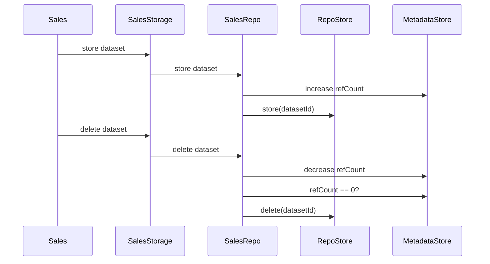

On startup, state machine states are restored for active slots, effectively
skipping previous states that incremented the ref count. Therefore, the ref
count must be persisted so that the ref count reflects the full and partial
datasets on disk. To illustrate, let's use the case where the node hosted a slot
and it went down in the process of renewing the same slot but had not filled it
yet. In this case, the ref count for a dataset would be 2. Upon node restart,
two things will happen: the corrective cleanup routine will try to delete the
renewal dataset that was being processed and the filled slot would get restored
to its previous point in the state machine, where it will attempt to delete the
dataset when it's finished. If the ref count had not been persisted, it would be
0, and the corrective cleanup would delete the dataset that is currently filled,
which could cause the SP to be slashed.

Ref count handling can be managed in `SalesRepo` module, and it can be persisted
in the `MetadataStore`. This module is responsible for interacting with the
underlying `RepoStore`, and managing the internal ref count. It will expose
functions for storing and deleting datasets.

Note that any calls to ref count should be locked, as they may be read and
updated concurrently.

This is how the `SalesRepo` module will interact with `RepoStore` and the
marketplace:

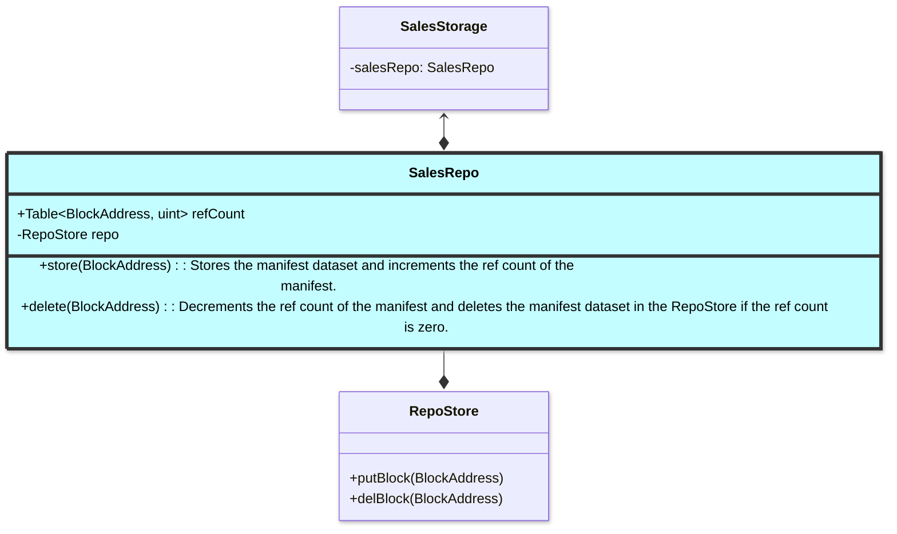

#### Alternative idea

Preventing deletion of datasets that are downloading or generating proofs can
also be achieved by checking if there are more than one `/active` (reached
downloading) `SalesOrders` with the same `hash(treeCid, slotIndex)` that exist.
If there are not, delete the dataset. Finally, archive the `SalesOrder`.

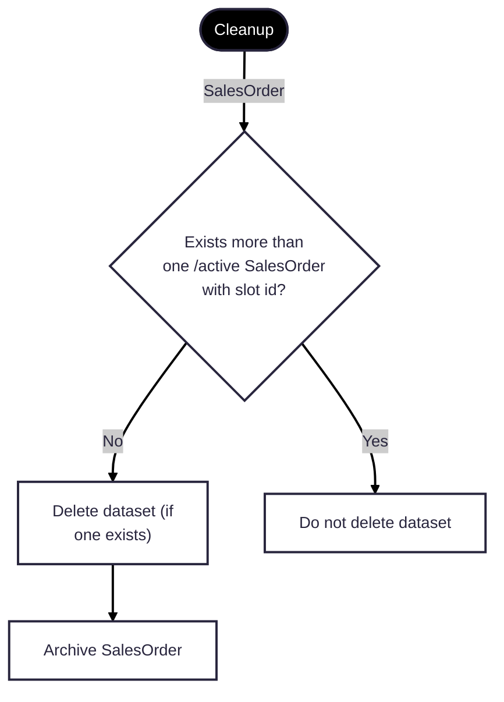

### Resuming local state, eg downloading

Depends on: Tracking latest state machine state

If a node shuts down or crashes while processing a slot before it was able to
fill the slot, it can be
possible to recover the state and resume where it left off. The latest state that
each sale reached [would be tracked](#tracking-latest-state-machine-state) in
the `SalesOrder` object. On restart, the state of each of these `SalesOrders`
would be restored, similar to how state is [restored for on chain filled
slots](#restoring-on-chain-state). A new `SalesAgent` would be created for each
local `SalesOrder`, starting in the state of the state machine that it left off
in.

Because the local `SalesOrder` state is getting restored, and there is a deterministic active
cleanup at the conclusion of the state machine, corrective cleanup would no
longer be needed.

Careful consideration would need to be taken in each state machine step to
ensure that any assumptions at each state are validated at the start, as it
cannot be guaranteed that previous states will have been visited first.

Additionally, order of state restoration must occur before corrective cleanup
and slot matching to ensure that actively processed slots are not deleted by the
corrective cleanup. It is important to note that restoring of on chain state to
occur first to minimise any penalties that could incur for missed proofs.

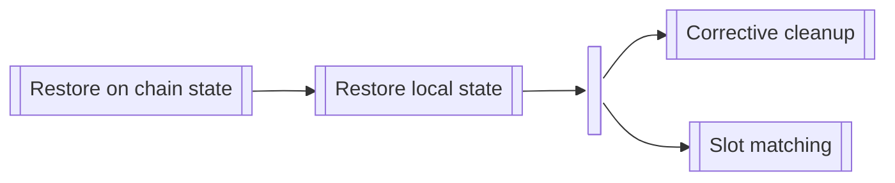

## Purchasing

## Design rules

Based on past implementations of the sales and purchasing modules, a couple of
rules have been created that the design in this document should not deviate
from.

### Objects MUST NOT perform accounting

The first, and most important, rule is that there should never be any accounting
operations where there is a "source of truth", particularly `Availabilities`.
Accounting incorporates actions done in other modules of the Codex node (eg
storage) or in the contracts (eg collateral), and then reflecting those changed
values back into the `Availability`. Accounting is not a good idea for several
reasons.

Firstly, there are a large number of logic branches that are
created where accounting updates need to occur, creating a significant
amount of complexity in the codebase. This makes the code difficult to reason
about and therefore difficult to ensure that all possible scenarios are covered.
In other words, this creates many edge cases, associated bugs, and a larger
testing burden. This is further exacerbated with concurrent workers.

Secondly, accounting updates are not atomic with their underlying operation.
This opens up the potential for unrecoverable exceptions or a `SIGTERM` after
the underlying operation but before the accounting update, leaving the object,
eg `Availability`, out of sync.

Finally, values that would require accounting should instead be sourced from
their underlying modules, as the "source of truth". For example, "available
collateral" can be sourced from the balance of the funding wallet, and
"available storage" can be sourced from the remaining quota of the `SalesRepo`.

Examples of the "no accounting" rule:

1. No slot size accounting
2. No collateral accounting
3. No reservations accounting (reservations were removed anyway due to a design
   change in the RepoStore)

An example of how this rule does not apply is with the `SalesRepo` module. The
`SalesRepo` module stores a `refCount`, but only because that information does
not exist in the underlying `RepoStore` as the "source of truth".

### `Availabilities` MUST NOT represent past or active sales

`Availabilities` MUST represent future sales only. A SP's availability defines
the conditions of sales they are willing to enter into. After entering
into a sale, a SP can update its availability, and therefore change the
conditions to be met for future sales. If the `Availability` was linked to the
past or future sales, updating the availability would lose information
pertaining to those sales.

In the design, this rule has been followed by copying information from the
matched `Availability` into a `SalesOrder`.

## Appendix A. Complete sales architecture

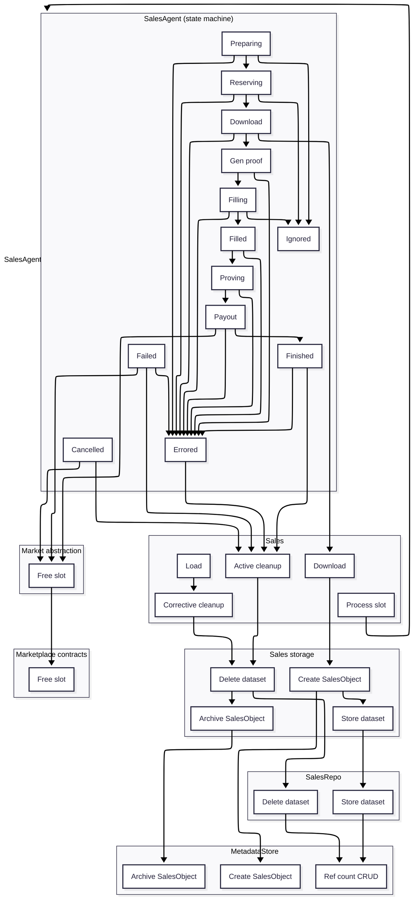
