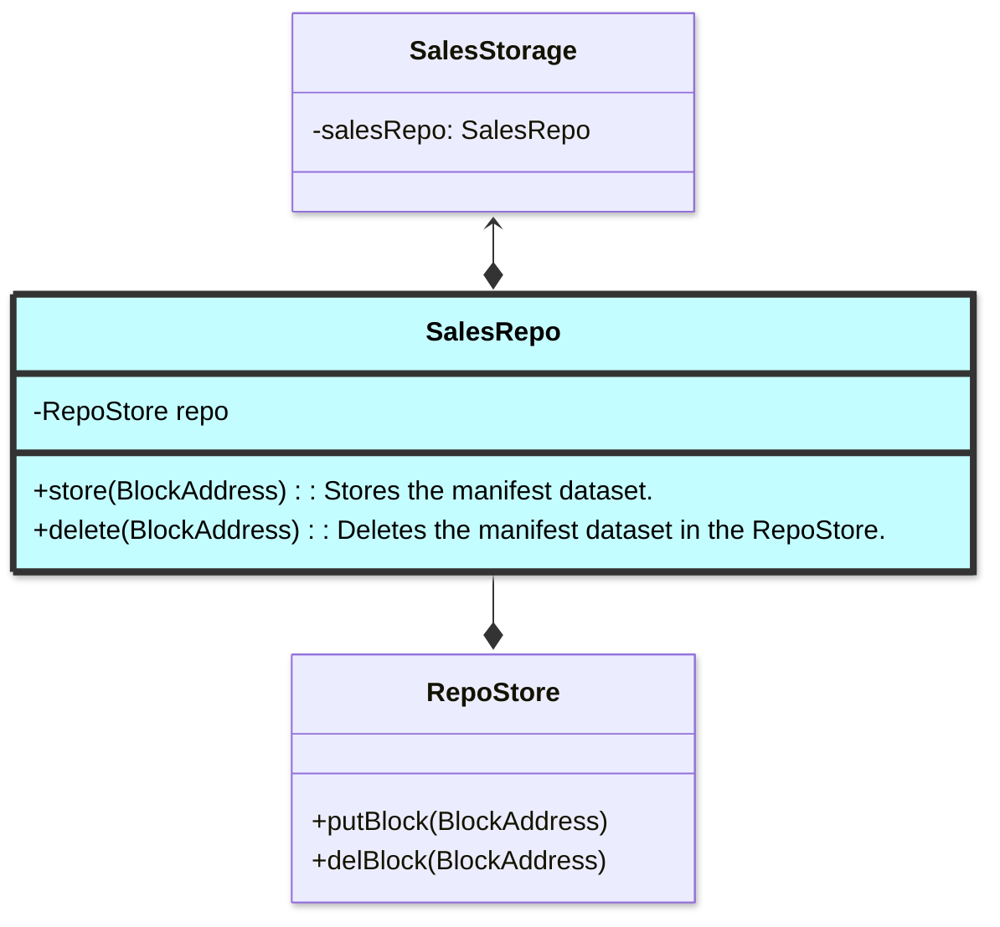
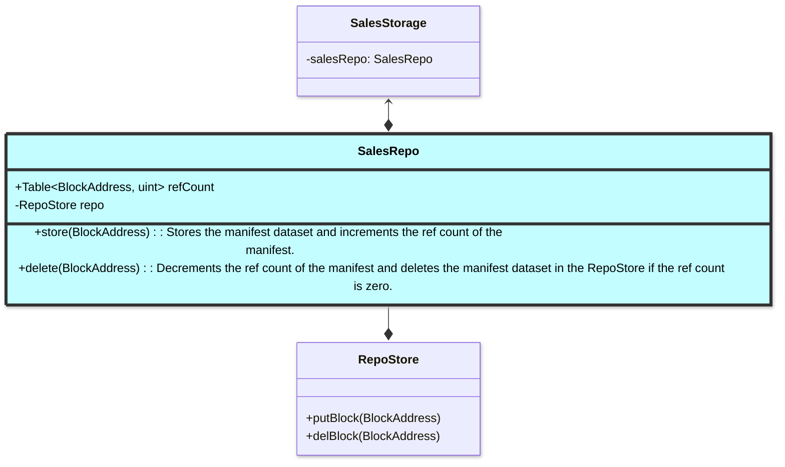

# Sales module (add purchasing module)

The sales module is responsible for selling a node's available storage in the
[marketplace](./marketplace.md). In order to do so, it needs to create an
Availability for the storage provider (SP) to establish under which
conditions it is willing to enter into a sale.

```ascii
------------------------------------------------------------------
|                                                                |
|    Sales                                                       |
|                                                                |
|    ^   |                                                       |
|    |   |    updates    ------------------                      |
|    |   --------------> |                |                      |
|    |                   |  SalesStorage  |                      |
|    ------------------- |                |                      |
|          queries       ------------------                      |
|                           ^         ^                          |
|                           |         |                          |
|                           |         | Availability + SaleOrder |
|           dedicated quota |         | state                    |
|                           v         v                          |
|               ----------------    -----------------            |
|               |  SalesRepo   |    | MetadataStore |            |
|               ----------------    -----------------            |
------------------------------------------------------------------
```

The `SalesStorage` module manages the SP's availability and snapshots of past
and present sales or `SalesOrders`, both of which are persisted in the `MetadataStore`. SPs can add
and update their availability, which is managed through the `SalesStorage`
module. As a `SalesOrder` traverses the sales state machine, it is created and
updated<sup>1</sup> through the `SalesStorage` module. Queries for availability
and `SalesOrders` will also occur in the `SalesStorage` module. Datasets that
are downloaded and deleted as part of the sales process will be handled in the
`SalesRepo` module.

<sup>1</sup> Updates are only needed to support [tracking the latest state in
             the `SalesOrder`](#tracking-latest-state-machine-state).

## Query support

The `SalesStorage` module will need to support querying the availability and sales
data so the caller can understand if a sale can be serviced and to support clean
up routines. The following queries will need to be supported:

1. To know if there is enough space on disk for a new sale, the `SalesStorage`
   module can be queried for the remaining sales quota in its dedicated
   `SalesRepo` partition. In the future, this can be optimised to [prevent
   unnecessary resource
   consumption](#concurrent-workers-prevent-unnecessary-resource-consumption),
   by additionally querying the slot size of `SalesOrders` that are in or past
   the Downloading state.
2. Clean up routines will need to know the "active sales", or any `SalesOrders`
   in the `/active` key namespace (those that have not been archived) through
   the state machine or clean up routines.
3. Servicing a new slot will require sufficient "total collateral", which is the
   remaining balance in the funding account. In the future, this can be
   optimised to [prevent unnecessary resource
   consumption](#concurrent-workers-prevent-unnecessary-resource-consumption),
   by additionally querying the collateral of `SalesOrders` that are in or past
   the Downloading state.

## `SalesRepo` module

The `SalesRepo` module is responsible for interacting with its underlying
`RepoStore`. This additional layer abstracts away some of the required
implementation routine needed for the `RepoStore`, while also allowing the
`RepoStore` to change independent of the sales module. It will expose functions
for storing and deleting datasets:



## Availability

The SP's availability determines which sales it is willing to attempt to enter
into. In other words, it represents *future sales* that an SP is willing to take
on. It consists of parameters that will be matched to incoming storage
requests via the slot queue.


| Property                   | Description                                                                                                                                          |
|----------------------------|------------------------------------------------------------------------------------------------------------------------------------------------------|
| `id`                       | ID of the Availability. Note: this is only needed if there is support for [multiple availabilities](#multiple-availabilities).                       |
| `duration`                 | Maximum duration of a storage request the SP is willing to host new slots for.                                                                       |
| `minPricePerBytePerSecond` | Minimum price per byte per second that the SP is willing to host new slots for.                                                                      |
| `enabled`                  | If set to false, the availability will not accept new slots. Updates to this value will not impact any existing slots that are already being hosted. |
| `until`                    | Specifies the latest timestamp after which the availability will no longer host any slots. If set to 0, there will be no restrictions.               |

The availability of a SP consists of the maximum duration and the minimum price
per byte per second to sell storage for.

### Funding account vs profit account

SPs should control two accounts: a funding account, and a profits account. The
funds in the funding account represent the total collateral that a SP is willing
to risk in all of its sales combined. This account will need to have some funds
in it before slots can be hosted, assuming the storage request requires
collateral. If a SP has been partially or wholly slashed in one of their sales,
they may wish to top up this account to ensure there is sufficient collateral
for future sales.

The profits account is the account for which proceeds from sales are paid into.
To minimise risk, this account should be stored in cold storage.

It is recommended that the profit account is a separate account from the funding
account so that profits are not placed at risk by being used as collateral. If a
SP specifies the same account for funding and profits, and the SP is (partially
or wholly) slashed, future collateral deposits may use their profits from
previous sales.

Note: having a separate profit account relies on the ability of the Vault
contract to support multiple accounts.

### Total collateral

The concept of "total collateral" means the total collateral the SP is willing
to risk at any one point in time. In other words, it is willing to risk "total
collateral" tokens for all of its active sales combined. Total collateral is
determined by the balance of funds in the SP's funding account. So, any funds in
the funding account are considered available to use as collateral for filling
slots.

From the marketplace perspective, slots cannot be filled if there is an
insufficient balance in the funding account.

### `Availability` lifecycle

A user can add, update, or delete an `Availability` at any time. The
`Availability` will be stored in the MetadataStore. Only one `Availability` can
be created and once created, it will exist permanently in the MetadataStore
until it is deleted. The properties of a created `Availability` can be updated
at any time.

Because availability(ies) represents *future* sales (and not active sales), and
because fields of the matching `Availability` are persisted in a `SalesOrder`,
availabilities are not tied to active sales and can be manipulated at any time.

## `SalesOrder` object

The `SalesOrder` object represents a snapshot of the sale parameters at the time
a slot is processed in the slot queue. It can be thought of as the market
conditions at the time of sale. It includes fields of the storage request, slot,
and the matching availability fields.

| Property                   | Description                                                                                                                                                                                       |
|----------------------------|---------------------------------------------------------------------------------------------------------------------------------------------------------------------------------------------------|
| `requestId`                | RequestId of the StorageRequest. Can be used to retrieve storage request details.                                                                                                                 |
| `slotIndex`                | lot index of the slot being processed.                                                                                                                                                            |
| `duration`                 | `duration` from the matched Availability.                                                                                                                                                         |
| `minPricePerBytePerSecond` | `minPricePerByte` from the matched Availabilty.                                                                                                                                                   |
| `state`                    | Latest state in the sales state machine that was reached. Note: this is only needed when there support for [tracking the latest state in the `SalesOrder`](#tracking-latest-state-machine-state). |

### `SalesOrder` lifecycle

At the point a SP reaches the `SaleDownload` state, a `SalesOrder` is created
and it will live permanently in the MetadataStore. `SalesOrder` objects cannot
be deleted as they represent historical sales of the SP.

When the `SalesOrder` object is first created, its key will be created in the
`/active` namespace. After data for the `SalesOrder` has been deleted (if there
is any) in a clean up procedure, the key will be moved from the `/active`
namespace to the `/archive` namespace. These key namespace manipulations
facilitate future lookups in active/passive clean up operations.

If there's support for [tracking the latest state in the
`SalesOrder`](#tracking-latest-state-machine-state), `SalesOrder.state`
will be modified as the sale progresses through each state of the Sales state
machine.

## Cleanup routines

The responsibility of the cleanup routine is to ensure that any data associated
with a Sale is deleted from the `SalesRepo`. Once the data has been deleted, the
`SalesOrder` will reflect that it has been cleaned up by being archived.

There are two types of cleanup routines that a SP node will take part in: active
and passive. Active cleanup routines are run as part of a state in the Sales
state machine. Passive cleanup routines are continuously run at a specified time
interval. Both perform a similar task, however the active cleanups operate on a
single `SalesOrder`, while passive cleanups operate over a set of `SalesOrders`
and have additional conditions for cleanup.

### Active cleanup

The active cleanup routine is typically run as part of the a final state in the
Sales state machine, ie `SaleFinished`. In this routine, active sales will be
retrieved from the Marketplace contract via `mySlots`. If the slot id associated
with the sale is not in the set of active sales, any data associated with the
slot will be deleted. Then, the `SalesOrder` will be archived, by moving its key
to the `/archive` namespace.

### Passive cleanup

At regular time intervals, active sales will be retrieved from the Marketplace
contract via `mySlots`. Then, all `SalesOrders` in the `/active` namespace will
be queried. Any `SalesOrders` with a slot id not in the set of active sales and
with a `StorageRequest` state that is "completed" (failed, cancelled, finished),
will have the data associated with the slot deleted, if there is any. Then, the
`SalesOrder` will be archived by moving its key to the `/archive` namespace.
`SalesOrders` with a `StorageRequest` state that is not yet completed should not
have their data deleted, as the SP may be in the process of starting to host a
slot, with the sale in an early state of the Sales state machine.

### Node startup

On node startup, the passive cleanup routine should be run.

## Sale flow

[Insert flow charts]

## Optimisations and features

### Multiple availabilities

Multiple availabilities are useful to allow SPs to understand which Availability
parameters produce the most profit for them. Multiple availabilities can be
updated or deleted at any time. This is possible because there is no
availability ID stored in the `SalesOrder` object.

Note that the total collateral across all availabilities that a SP is
willing to risk remains as the balance of funds in the funding account.

### Concurrent workers support

Concurrent workers allow a SP to reserve, download, generate an initial proof
for, and fill multiple slots simultaneously. This could prevent SPs from missing
sale opportunities that arise while they are reserving, downloading, generating,
and generating an initial proof for another sale. The trade off, however, is
that concurrent workers will require more system resources than a single worker.
In addition, concurrency is difficult to reason about, can introduce
difficult-to-debug bugs, and also opens up the possibility of unnecessary
reserving, downloading, and proof generation (discussed below). Therefore, it is
imperative this feature is implemented carefully.

### Tracking latest state machine state

Tracking the latest state machine state in locally persisted `SalesOrders` can
allow for historical sales listings (eg REST api or Codex app), sales
performance analysis (eg profit), and availability optimisations.

After a `StorageRequest` is completed, it is removed from the contract's
`mySlots` storage, with a locally-persisted `SalesOrder` being the only
remaining information about the sale. Without having the latest state persisted,
`SalesOrders` will be archived, but the SP will not know what the final state of
a `SalesOrders` was when it was archived. For example, it will not be able to
distinguish between a sale that errored and a slot that was successfully
hosted. This information is useful for listing states of sales, but also for
optimisations.

Active sale data is stored on chain in the Marketplace contract (`mySlots`).
However, these slots are slots that have already been filled by the SP.
When making a decision to service a new slot, the SP can optimise its decision
with information about sales that may be at an earlier stage in the sales
process, ie downloading, proof generating, or filling. To
facilitate this, `SalesOrder.state` would need to track the latest state of the
sale in the sales state machine.

Tracking the latest state opens up the possibility for further optimisations,
see below.

### Concurrent workers: prevent unnecessary resource consumption

Depends on: Tracking latest state machine state<br/>
Depends on: Concurrent workers

To prevent unnecessary reserving, downloading, and proof generation when there
are concurrent workers, when checking to ensure there's enough collateral
available, instead of only checking the funding account's current balance, also
check collateral that will be used to fill slots in `SalesOrders` that are
`/active`. Without this check, SPs may reserve, download, and generate a proof
for a sale that would ultimately result in not having enough collateral. For
example, if funding account balance is 100, and the SP is currently downloading
two sales with 100 collateral each, then that would mean that the download that
finishes last will ultimately be wasted as the SP would not have enough
collateral to fill both slots.

### Renewals: prevent dataset deletion

During renewals, there could potentially be a new sale for the same dataset that
is already in an active sale. The `SlotId` (and `RequestId`) will differ,
however the CID will be the same. Renewals should occur well before the initial
sale finishes. However, if the new sale is close in time to the completion of
the first sale, then as the dataset for the first sale is being cleaned up,
it may delete the dataset that is needed by the new sale. The new sale may have
been in the process of being downloaded, or having proofs generated.

This can be prevented by having an in-memory ref count of datasets. When a
dataset is stored, the ref count of the dataset (`hash(treeCid, slotIndex)`) is
incremented. When the dataset is deleted, the ref count is decremented. Only
when the ref count is 0 is the dataset actually deleted in the `RepoStore`. The
ref count does not require persistence because on startup, hosted slots will not
be deleted.

Ref count handling can be managed in `SalesRepo` module. This module is
responsible for interacting with the underlying `RepoStore`, and managing the
internal ref count. It will expose functions for storing and deleting datasets.

Note that any calls to ref count should be locked, as they may be read and
updated concurrently.

This is how the `SalesRepo` module will interact with `RepoStore` and the
marketplace:



#### Alternative idea

Preventing deletion of datasets that are being downloaded or proof generating
can also be achieved by first checking if the slot id exists in `/mySlots` (at this stage
the initial sale should no longer be in `/mySlots`). If it does not, then check
if there are more than one `/active` (reached downloading) `SalesOrders` with
the same `hash(treeCid, slotIndex)` that exist. If there are not, delete the
dataset. Finally, archive the `SalesOrder`.


## Purchasing

